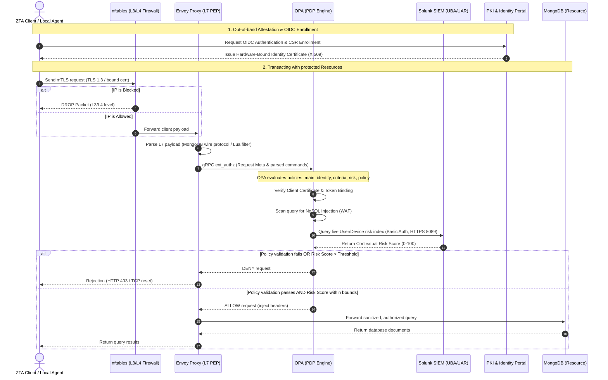

# Zero Trust Architecture (ZTA) - Secure Healthcare Infrastructure

[](https://img.shields.io/badge/License-Academic-blue.svg)
[](https://www.python.org/)
[](https://swift.org/)
[](https://docs.docker.com/compose/)

This repository implements a multi-layer **Zero Trust Architecture (ZTA)** tailored for secure healthcare environments. The system implements a robust security perimeter combining hardware-bound identities (TPM 2.0 / Secure Enclave), Layer 7 API/database query inspection, real-time risk engine evaluations, centralized SIEM event analysis, and active SOAR intrusion prevention.

---

## 🛠️ Technology Stack

The project leverages a modern, dockerized cybersecurity stack:

- **Identity & PKI Portal**: Python 3.13 (Flask) managed using the `uv` package manager.
- **Policy Enforcement Point (PEP)**: Envoy Proxy.
- **Policy Decision Point (PDP)**: Open Policy Agent (OPA).
- **Database (Asset)**: MongoDB.
- **Firewall L3/L4**: nftables.
- **Network Intrusion Detection (NIDS)**: Snort 3 (deployed as dual probes inside Envoy and MongoDB namespaces).
- **SIEM (Security Information & Event Management)**: Splunk Enterprise.
- **Client Agents**: Swift 6 (macOS Secure Enclave) and PowerShell (Windows TPM).

---

## 🗺️ Project Architecture

The architecture enforces a strict **"Never Trust, Always Verify"** design across three primary boundaries: L3/L4 Network Filtering, L7 Protocol Inspection, and Dynamic Multi-Source Risk Evaluation.

### Data Flow & Request Lifecycle



---

## ⚡ Getting Started

Follow these steps to run the complete infrastructure, configure the components, and verify the Zero Trust behavior.

### Prerequisites
- **Docker Desktop** installed and running.
- **Python 3.10+** (recommended to manage libraries with `uv` or `venv`).
- Standard shell utility (`bash`, `zsh` or PowerShell).

### Setup and Configuration

1. **Initialize Environment Variables**:
   Copy the example environment configuration into a local file:
   ```bash
   cp .env.example .env
   ```
   *(The default `.env` is pre-configured with secure default ports, credentials, and credentials values for Splunk/MongoDB).*

2. **Boot the Security Mesh**:
   Build and launch all Docker services in detached mode:
   ```bash
   docker compose up --build -d
   ```
   *Note: Allow 30–45 seconds for Splunk and MongoDB services to fully boot and run initialization scripts.*

3. **Configure the Splunk Connection**:
   - Access Splunk Web UI at **`http://localhost:8000`** (User: `admin` | Password: `SplunkPassword123!`).
   - Go to **Settings > Data Inputs > HTTP Event Collector**.
   - Select **Global Settings** and ensure HEC is **Enabled**.
   - Create a new token named `zta_token`, assign it default access to index `zta_envoy`, and save.
   - Update `SPLUNK_HEC_TOKEN_ENVOY` in your `.env` with the generated token.
   - Restart the forwarder daemon:
     ```bash
     docker compose up -d --force-recreate zta-log-forwarder
     ```

4. **Trust Certificate and Start Agent**:
   - Trust the root Certificate Authority file located at `volumes/certs/ca/ca.crt` on your OS.
   - Run the local TPM Agent service on Windows:
     ```powershell
     powershell -ExecutionPolicy Bypass -File .\scripts\windows\tpm_agent_service.ps1
     ```

---

## 📁 Project Structure

```text
AdvancedCybersecurity/
├── docker-compose.yml        # Docker Multi-Container orchestration definition
├── pyproject.toml            # Python workspace dependencies, tooling (ruff)
├── uv.lock                   # Lockfile for Python dependencies
├── .env.example              # Template environment variables setup
├── README.md                 # Project README documentation
├── CLAUDE.md                 # Project development constraints & workflows
├── AGENTS.md                 # AI assistant execution rules and skill mapping
├── identity_pki/             # Flask PKI Portal
│   ├── app.py                
│   ├── routes/               
│   └── tests/                
├── envoy/                    # Envoy Proxy (PEP) config
├── opa/                      # OPA (PDP) server & Rego authorization rules
│   └── policies/             # Access control, risk scoring, and rules
├── snort/                    # Snort 3 configuration and local signatures
│   └── rules/                # PEP (Envoy) and Resource (Mongo) rulesets
├── nftables/                 # Alpine firewall container
├── splunk/                   # Splunk App config
├── scripts/                  # Helper utilities and TPM client scripts
│   ├── windows/              # PowerShell agents (TPM attestation, local proxies)
│   └── zta_log_forwarder/    # Log forwarding daemon & active SOAR script
└── shared/                   # Common python models and role specifications
```

---

## 🚀 Key Features

- **Automated PKI & Attestation**: On-the-fly certificate issuance validating TPM and Secure Enclave hardware claims.
- **NoSQL Injection WAF**: OPA Rego rules inspect database queries to dynamically block `$where`, `$regex`, and `$function` operators before they reach MongoDB.
- **Dynamic Risk-Based ACLs**: Evaluates live network telemetry (such as JA3 fingerprints and Splunk anomaly data) to modify access controls at runtime.
- **SOAR Active Response Loop**: Auto-defense system where NIDS alerts automatically isolate and restrict malicious source IPs at L3/L4 level.
- **Enterprise-Grade SIEM Integration**: Direct ingestion of TLS-encrypted syslog feeds from the complete infrastructure to a dedicated Splunk Dashboard.

---
