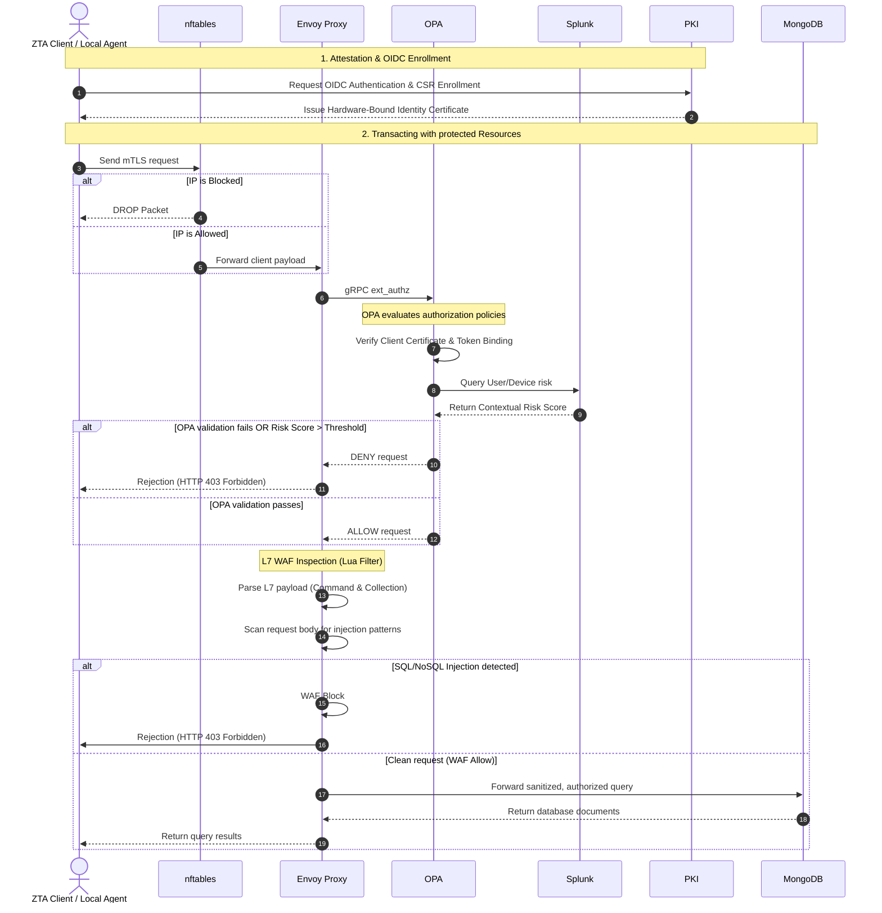

# Zero Trust Architecture (ZTA) - Secure Healthcare Infrastructure

[](https://img.shields.io/badge/License-Academic-blue.svg)
[](https://www.python.org/)
[](https://swift.org/)
[](https://docs.docker.com/compose/)

This repository implements a multi-layer **Zero Trust Architecture (ZTA)** tailored for secure healthcare environments. The system implements a robust security perimeter combining hardware-bound identities (TPM 2.0 / Secure Enclave), Layer 7 API/database query inspection, real-time risk engine evaluations, centralized SIEM event analysis, and active SOAR intrusion prevention.

---

## Technology Stack

The project leverages a modern, dockerized cybersecurity stack:

- **Identity & PKI Portal**: Python 3.13 (Flask) managed using the `uv` package manager.
- **Policy Enforcement Point (PEP)**: Envoy Proxy.
- **Policy Decision Point (PDP)**: Open Policy Agent (OPA).
- **Database (Asset)**: MongoDB.
- **Firewall L3/L4**: nftables.
- **Network Intrusion Detection (NIDS)**: Snort 3 (deployed as dual probes inside Envoy and MongoDB namespaces).
- **SIEM (Security Information & Event Management)**: Splunk Enterprise.
- **Client Agents**: Swift 6 (macOS Secure Enclave) and PowerShell (Windows TPM).

---

## Project Architecture

The architecture enforces a strict **"Never Trust, Always Verify"** design across three primary boundaries: L3/L4 Network Filtering, L7 Protocol Inspection, and Dynamic Multi-Source Risk Evaluation.

### Data Flow & Request Lifecycle



---

## Getting Started

Follow these steps to run the complete infrastructure, configure the components, and verify the Zero Trust behavior.

### Prerequisites

- **Docker Desktop** installed and running.
- **Python 3.10+** (recommended to manage libraries with `uv` or `venv`).
- Standard shell utility (`bash`, `zsh` or PowerShell).

### Setup and Configuration

1. **Initialize Environment Variables**:
   Use the `.env` file sent via email and place it in the root directory.


2. **Boot the Security Mesh**:
   Build and launch all Docker services in detached mode:

   ```bash
   docker compose up --build -d
   ```

3. **Splunk Verification**:
   - Access the Splunk Web UI at **`http://localhost:8000`** (credentials are defined in the `.env` file).
   - All security indexes (`zta_envoy`, `zta_snort`, etc.) and the HTTP Event Collector (HEC) token `zta_token` are configured **automatically** at boot using the `SPLUNK_HEC_TOKEN` value from `.env`.
   - In the Splunk Web UI sidebar, click on **ZTA App** to access the pre-configured security logs dashboard.


4. **Trust Certificate and Start Agent**:
   - Trust the root Certificate Authority file located at `volumes/certs/ca/ca.crt` on your OS.
   - On macOS, open the `ztaagent/ZTAAGENT.xcodeproj` file using Xcode. Make sure to update the Team in the Signing & Capabilities tab to successfully build and run the agent.
   - On Windows, run the local TPM Agent service on Windows:
     ```powershell
     powershell -ExecutionPolicy Bypass -File .\scripts\windows\tpm_agent_service.ps1
     ```


---

## Project Structure

```text
AdvancedCybersecurity/
├── docker-compose.yml        # Docker Multi-Container orchestration definition
├── .env.example              # Template environment variables setup
├── identity_pki/             # Flask PKI Portal
│   ├── app.py
│   ├── routes/
│   └── tests/
├── envoy/                    # Envoy Proxy config
├── opa/                      # OPA server & Rego authorization rules
│   └── policies/             # Access control, risk scoring, and rules
├── snort/                    # Snort 3 configuration and local signatures
│   └── rules/                # PEP (Envoy) and Resource (Mongo) rulesets
├── nftables/                 # Alpine firewall container
├── splunk/                   # Splunk App config
├── scripts/                  # Helper utilities and TPM client scripts
│   ├── windows/              # PowerShell agents (TPM attestation, local proxies)
│   └── zta_log_forwarder/    # Log forwarding
└── shared/                   # Common python models and role specifications
```

---


### Roles and Permissions Matrix

| User | Role | Allowed Collections | Operations / Permissions |
|------|------|----------------------|---------------------------|
| `test.admin` | System Administrator | `*` (All Collections) | Full Access (Read/Write/Delete) |
| `test.doctor` | Doctor | `patients`, `providers`, `admissions`, `clinical_records` | Read/Write (Row-Level Security Enforced) |
| `test.auditor` | Auditor | `patients`, `providers`, `admissions`, `clinical_records`, `billing` | Read-Only (Data Masking Enforced) |
| `test.receptionist`| Receptionist | `patients`, `admissions`, `providers` | Read/Write (No Clinical Data) |
| `test.billing` | Billing Staff | `patients`, `providers`, `admissions`, `billing` | Read/Write (Billing Data Only) |


## Testing the Zero Trust Architecture
- Go to the PKI Portal at **`https://127.0.0.1:8080/`**.
- Authenticate with the user **`test.doctor`**.
- Insert the OTP sent to the email `zta.healthcare@outlook.com` (email credentials have been provided to you).
- Authenticate with the macOS Agent (or TPM on Windows) to complete the hardware attestation.
- Try performing allowed and denied operations against the proxy to see OPA and Splunk in action!

### Monitoring the Risk Engine in Splunk

1. **Viewing Raw Logs**:
   In the Splunk Web UI search bar (`http://localhost:8000`), you can view the raw security logs using the following filters:
   - For Snort NIDS alerts: `index="zta_snort"`
   - For Envoy Proxy decisions: `index="zta_envoy"`

2. **Populating the User Baseline**:
   The contextual risk engine relies on historical data to detect anomalies. Instead of waiting for the hourly cron job to run, after you perform some initial allowed operations, manually populate the baseline by running this query:
   ```spl
   index=zta_envoy sourcetype="opa:decision" earliest=-7d
   | bucket _time span=15m 
   | stats count as query_count by user, _time 
   | collect index=zta_baseline_summary
   ```

3. **Checking the Contextual Risk**:
   Now, check the dynamic risk score calculated for your user by executing the saved search:
   ```spl
   | savedsearch "Calcolo_Rischio_Contestuale_ZTA" user="test.doctor" client_ip="192.168.65.1"
   ```
   *(Note: Change `test.doctor` to whichever user you are testing with). If you only performed allowed operations, the risk score should be **0**.*

4. **Generating Risk (Denied Operations)**:
   Perform some denied operations (e.g., trying to access unauthorized endpoints or perform actions outside your role's permissions). Re-execute the saved search from step 3. You will see the risk score rise dynamically based on the policy violations.

5. **Generating Risk (Network Intrusions)**:
   Simulate a network attack by opening a terminal and running the following port scans against the proxy:
   ```bash
   nmap -p 9901 localhost
   nmap -p 10000-10020 localhost
   ```
   Check the new alerts generated by Snort (`index="zta_snort"`). Re-execute the saved search from step 3 once more: you will see the risk score spike dramatically due to the active intrusion detection penalties.

6. **Handling Blocklists (Automated SOAR)**:
   If the risk score exceeds the critical threshold (e.g., > 50) due to consecutive denied actions or network intrusions, the automated SOAR mechanism will permanently ban your IP in the L3/L4 Firewall (`nftables`), cutting off all connection to the proxy.
   To restore your access, you must log in to the PKI Portal as an administrator (`test.admin`), navigate to the **Firewall Blocklist** management section, and manually remove your IP (`192.168.65.1`) from the banned list.

---
