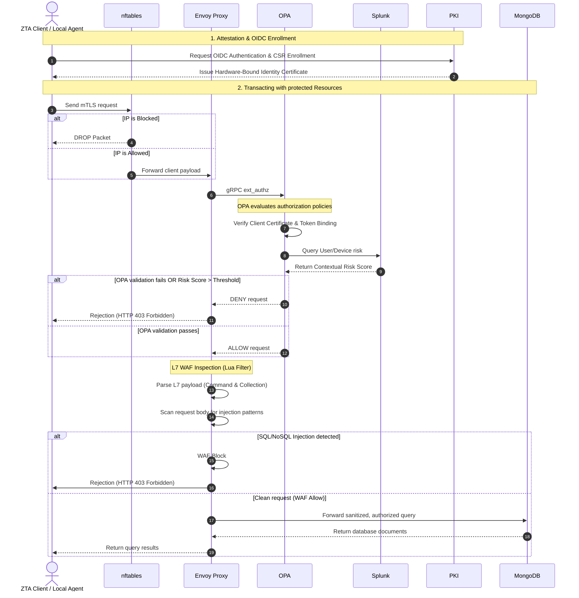

# Zero Trust Architecture (ZTA) - Secure Healthcare Infrastructure

[](https://img.shields.io/badge/License-Academic-blue.svg)
[](https://www.python.org/)
[](https://swift.org/)
[](https://docs.docker.com/compose/)

This repository implements a multi-layer **Zero Trust Architecture (ZTA)** tailored for secure healthcare environments. The system implements a robust security perimeter combining hardware-bound identities (TPM 2.0 / Secure Enclave), Layer 7 API/database query inspection, real-time risk engine evaluations, centralized SIEM event analysis, and active SOAR intrusion prevention.

---

## Technology Stack

The project leverages a modern, dockerized cybersecurity stack:

- **Identity & PKI Portal**: Python 3.13 (Flask) managed using the `uv` package manager.
- **Policy Enforcement Point (PEP)**: Envoy Proxy.
- **Policy Decision Point (PDP)**: Open Policy Agent (OPA).
- **Database (Asset)**: MongoDB.
- **Firewall L3/L4**: nftables.
- **Network Intrusion Detection (NIDS)**: Snort 3 (deployed as dual probes inside Envoy and MongoDB namespaces).
- **SIEM (Security Information & Event Management)**: Splunk Enterprise.
- **Client Agents**: Swift 6 (macOS Secure Enclave) and PowerShell (Windows TPM).

---

## Project Architecture

The architecture enforces a strict **"Never Trust, Always Verify"** design across three primary boundaries: L3/L4 Network Filtering, L7 Protocol Inspection, and Dynamic Multi-Source Risk Evaluation.

### Data Flow & Request Lifecycle



---

## Getting Started

Follow these steps to run the complete infrastructure, configure the components, and verify the Zero Trust behavior.

### Prerequisites

- **Docker Desktop** installed and running.
- **Python 3.10+** (recommended to manage libraries with `uv` or `venv`).
- Standard shell utility (`bash`, `zsh` or PowerShell).

### Setup and Configuration

1. **Initialize Environment Variables**:
   Use the `.env` file sent via email and place it in the root directory.


2. **Boot the Security Mesh**:
   Build and launch all Docker services in detached mode:

   ```bash
   docker compose up --build -d
   ```

3. **Splunk Verification**:
   - Access the Splunk Web UI at **`http://localhost:8000`** (credentials are defined in the `.env` file).
   - All security indexes (`zta_envoy`, `zta_snort`, etc.) and the HTTP Event Collector (HEC) token `zta_token` are configured **automatically** at boot using the `SPLUNK_HEC_TOKEN` value from `.env`.
   - In the Splunk Web UI sidebar, click on **ZTA App** to access the pre-configured security logs dashboard.


4. **Trust Certificate and Start Agent**:
   - Trust the root Certificate Authority file located at `volumes/certs/ca/ca.crt` on your OS.
   - On macOS, open the `ztaagent/ZTAAGENT.xcodeproj` file using Xcode. Make sure to update the Team in the Signing & Capabilities tab to successfully build and run the agent.
   - On Windows, run as administrator the local TPM Agent service on Windows:
     ```powershell
     powershell -ExecutionPolicy Bypass -File .\scripts\windows\tpm_agent_service.ps1
     ```


---

## Project Structure

```text
AdvancedCybersecurity/
├── docker-compose.yml        # Docker Multi-Container orchestration definition
├── .env.example              # Template environment variables setup
├── identity_pki/             # Flask PKI Portal
│   ├── app.py
│   ├── routes/
│   └── tests/
├── envoy/                    # Envoy Proxy config
├── opa/                      # OPA server & Rego authorization rules
│   └── policies/             # Access control, risk scoring, and rules
├── snort/                    # Snort 3 configuration and local signatures
│   └── rules/                # PEP (Envoy) and Resource (Mongo) rulesets
├── nftables/                 # Alpine firewall container
├── splunk/                   # Splunk App config
├── scripts/                  # Helper utilities and TPM client scripts
│   ├── windows/              # PowerShell agents (TPM attestation, local proxies)
│   └── zta_log_forwarder/    # Log forwarding
└── shared/                   # Common python models and role specifications
```

---


### Roles and Permissions Matrix

| User | Role | Allowed Collections | Operations / Permissions |
|------|------|----------------------|---------------------------|
| `test.admin` | System Administrator | `*` (All Collections) | Full Access (Read/Write/Delete) |
| `test.doctor` | Doctor | `patients`, `providers`, `admissions`, `clinical_records` | Read/Write (Row-Level Security Enforced) |
| `test.auditor` | Auditor | `patients`, `providers`, `admissions`, `clinical_records`, `billing` | Read-Only (Data Masking Enforced) |
| `test.receptionist`| Receptionist | `patients`, `admissions`, `providers` | Read/Write (No Clinical Data) |
| `test.billing` | Billing Staff | `patients`, `providers`, `admissions`, `billing` | Read/Write (Billing Data Only) |


## Testing the Zero Trust Architecture

Follow this test suite to validate every security boundary of the Zero Trust Architecture, from identity and data isolation to WAF inspection, intrusion detection, SOAR response, and SIEM risk scoring.

---

### 1. Row-Level & Field-Level Security (RLS / FLS)

Test that data access is restricted according to the **Least Privilege Principle** using MongoDB views and RBAC:

1. **Access the Web Console**:
   - Navigate to the PKI Portal at **`https://127.0.0.1:8080/`**.
   - Authenticate with username and password, then input the OTP code sent to `zta.healthcare@outlook.com`.
   - Complete hardware attestation via the local client agent (macOS ZTAAgent or Windows TPM Agent).

2. **Verify Role Isolation in the GUI**:
   - **As `test.doctor`**: Query the `clinical_records` collection. You receive full clinical notes, diagnoses, and test results via `v_clinical_doctor`. Attempting to query `billing` returns `RBAC_DENIED` (HTTP 403).
   - **As `test.auditor`**: Query the `clinical_records` collection. Patient names are pseudonymized to initials (`patient_initials`: `M.R.`) and exact ages are replaced with age bands (`30-50`) via `v_clinical_auditor`. Querying `billing` returns rounded amounts (`billing_amount_approx` to nearest 1,000) and masked insurance providers (`Blu***`) via `v_billing_auditor`. Writing data is strictly denied.
   - **As `test.billing`**: Querying `billing` returns full financial data via `v_billing_staff`. Attempting to query `clinical_records` returns `RBAC_DENIED` (HTTP 403).
   - **As `test.receptionist`**: Querying `patients` returns basic demographics via `v_patients_reception` (sensitive fields like `blood_type` are hidden). Access to `clinical_records` or `billing` is denied.

---

### 2. Layer 7 WAF Injection Scenarios (Directly from Web Console UI)

Envoy's L7 Lua WAF filter inspects incoming queries inline for malicious patterns before they reach the database. In the Web Console search/query input field, enter the following payloads to verify real-time blocking:

* **NoSQL Injection Test (`$where` / `$function` operators)**:
  - **Input Payload**: `{"$where": "this.age > 0"}` or `{"$function": "function() { return true; }"}`
  - **Expected Result**: Envoy L7 WAF intercepts the query and returns an **HTTP 403 Forbidden** error with message: `Blocked by L7 WAF: NoSQL Injection attempt detected (operator '$where' not allowed)`.

* **Denial of Service (DoS) Injection Test (Time Delays / Infinite Loops)**:
  - **Input Payload**: `{"full_name": "sleep(5000)"}` or `{"full_name": "while(true)"}`
  - **Expected Result**: Envoy L7 WAF blocks the execution immediately, returning **HTTP 403 Forbidden**: `Blocked by L7 WAF: Denial of Service attempt detected (time-delay pattern or infinite loop)`.

* **SQL Injection Test (Tautologies / Union Select)**:
  - **Input Payload**: `{"full_name": "admin' OR '1'='1"}` or `{"full_name": "union select 1,2,3--"}`
  - **Expected Result**: Envoy L7 WAF blocks the request, returning **HTTP 403 Forbidden**: `Blocked by L7 WAF: SQL Injection attempt detected`.

---

### 3. Intrusion Detection (Snort 3), SOAR Auto-Blocking & nftables Firewall

Test network-level intrusion detection and the automated SOAR mitigation pipeline:

1. **Simulate Perimeter Scan**:
   Open a terminal on your host machine and run port scans against the gateway:
   ```bash
   nmap -p 10000-10020 localhost
   ```
2. **Simulate Envoy Admin Probe**:
   Attempt unauthorized access to Envoy's management port:
   ```bash
   nmap -p 9901 localhost
   ```
3. **Simulate Direct Database Access / PEP Bypass**:
   Attempt to bypass Envoy by directly reaching MongoDB's native port:
   ```bash
   # On macOS / Linux:
   nc -zv localhost 27017

   # On Windows (PowerShell):
   Test-NetConnection -ComputerName localhost -Port 27017
   ```
4. **Automated SOAR & nftables L3/L4 Firewall Block**:
   - High-fidelity Snort alerts trigger the SOAR module in `zta_log_forwarder`, which writes the attacker's IP to the shared blocklist file `/app/blocklist/blocklist.txt`.
   - The **nftables** container reads `@blocklist` and drops all subsequent packets at the Linux kernel level (`NFT_BLOCKLIST_DROP`).
5. **Unblocking via Admin GUI**:
   - Log into the PKI Portal as `test.admin`.
   - Navigate to the **Firewall Blocklist** management tab.
   - View active blocked IPs and click **Unblock** to remove your IP from the firewall blocklist.

---

### 4. Risk Engine & Centralized SIEM Monitoring (Splunk)

Monitor real-time security events, UEBA behavior, and dynamic risk scoring:

1. **Access Splunk Web UI**:
   - Open **`http://localhost:8000`** in your browser.
   - Open the **ZTA App** dashboard from the left navigation panel.

2. **Splunk ZTA Command Center Dashboard**:
   - **Postura Zero Trust e Controllo degli Accessi**: View real-time charts comparing `ALLOW` vs `DENY` decisions, device authentication posture (`Hardware-Bound TPM` vs `no-tpm`), and top block reasons (`STEP_UP_REQUIRED`, `RBAC_DENIED`, `INSPECTION_VIOLATION`).
   - **Indicatori di Compromissione (IoC)**: Monitor alerts from `snort-pep` vs `snort-resource`, nftables port scanning attempts, and MongoDB brute force login attempts.
   - **Analisi Comportamentale (UEBA)**: Monitor volumetric anomalies (Z-Score > 2.0 / 3.0) and high-risk entity rankings (`User x IP x Device`).

3. **Calculating Dynamic Contextual Risk Score**:
   - Populate the historical user baseline:
     ```spl
     index=zta_envoy sourcetype="opa:decision" earliest=-7d
     | bucket _time span=15m 
     | stats count as query_count by user, _time 
     | collect index=zta_baseline_summary
     ```
   - Execute the contextual risk calculation search:
     ```spl
     | savedsearch "Calcolo_Rischio_Contestuale_ZTA" user="test.doctor" client_ip="192.168.65.1"
     ```
   - Observe how the **Risk Score** dynamically increases based on identity penalties (+30 unknown, +20 no-tpm, +15 external IP), query gravity, UBA volumetric spikes (+20/+40), and active Snort NIDS alerts (+80/+100).

---
