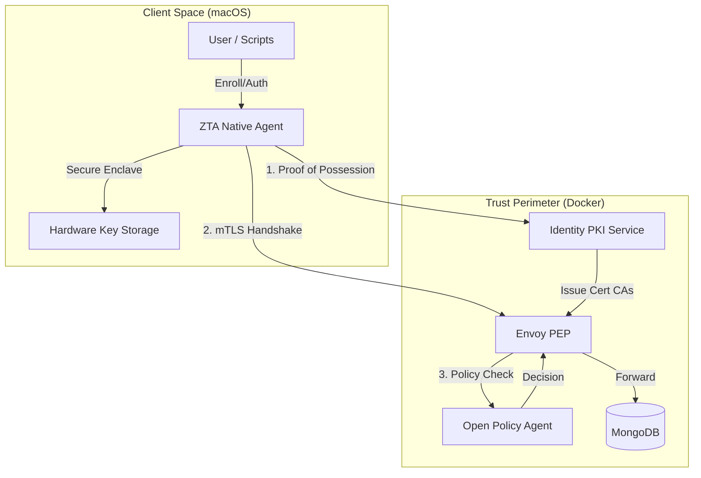

# Zero Trust Architecture — Technical Blueprint

This document details the modern, hardware-bound Zero Trust implementation for macOS, leveraging the Secure Enclave (SEP) and a native agent for end-to-end security.

## 1. High-Level Architecture

The system is built on a **Three-Layer Security Model**:

## 2. The Identity Lifecycle

### Phase 1: Hardware-Bound Enrollment
1.  **Key Generation**: The Native Agent requests the **Secure Enclave** to generate an EC P-256 key pair. The private key never leaves the hardware.
2.  **Hardware Attestation**: The Agent gathers hardware identifiers (Mac UUID, CPU Model).
3.  **Proof of Possession**: The Agent signs a challenge from the PKI server using the hardware key.
4.  **Certificate Issuance**: The PKI server verifies the signature, stores the hardware metadata, and issues an X.509 certificate linked to the hardware key's public part.

### Phase 2: Multi-Layer Authentication
*   **Layer 1 (Identity Verification)**: Before any network activity, the client must prove its identity to the PKI server by signing a fresh challenge. This unlocks the use of the identity for the current session.
*   **Layer 2 (Perimeter Gate - mTLS)**: All traffic to protected resources must pass through Envoy. Envoy requires a client certificate. The Native Agent performs the mTLS handshake, using **Touch ID / Bio-metrics** to authorize the use of the Secure Enclave key.
*   **Layer 3 (Policy Gate - OPA)**: Envoy extracts the identity from the certificate and the intent from the protocol (e.g., MongoDB BSON). OPA evaluates the risk based on user role, hardware health, and network location.

## 3. Native Agent Components

### ZTA Agent (macOS App)
*   **Technology**: Swift 6, Network.framework, Security.framework.
*   **Local API Server**: Listens on `localhost:9090` to serve local CLI tools (`enroll.py`, `authenticate.py`).
*   **Keychain Integration**: Automatically manages the link between the issued certificate and the Secure Enclave private key using `SecIdentity`.
*   **Hardware Discovery**: Uses `IOKit` and `sysctl` to provide tamper-resistant hardware fingerprints.

### Identity PKI (Python/Flask)
*   **Dynamic CA**: Manages a root CA that is rotated/initialized on startup.
*   **Envoy Sync**: Automatically generates and signs server certificates for the Envoy proxy, ensuring zero manual configuration.
*   **Metadata Registry**: Stores hardware info (MAC/CPU) for every issued certificate to prevent identity cloning.

## 4. Security Principles

1.  **Hardware Roots of Trust**: Private keys are non-exportable and protected by Apple's Secure Enclave.
2.  **Bio-metric Authorization**: Sensitive operations (mTLS handshake) can be tied to Touch ID.
3.  **Protocol-Aware Inspection**: Envoy decodes the MongoDB protocol, allowing OPA to make decisions based on specific collections or commands (e.g., "Allow 'find' but deny 'drop'").
4.  **Fail-Closed**: If any layer (Agent, PKI, OPA) is unavailable, access is denied by default.
