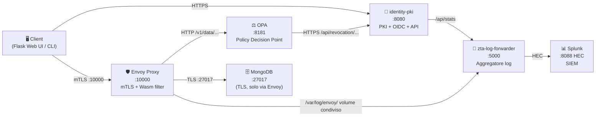
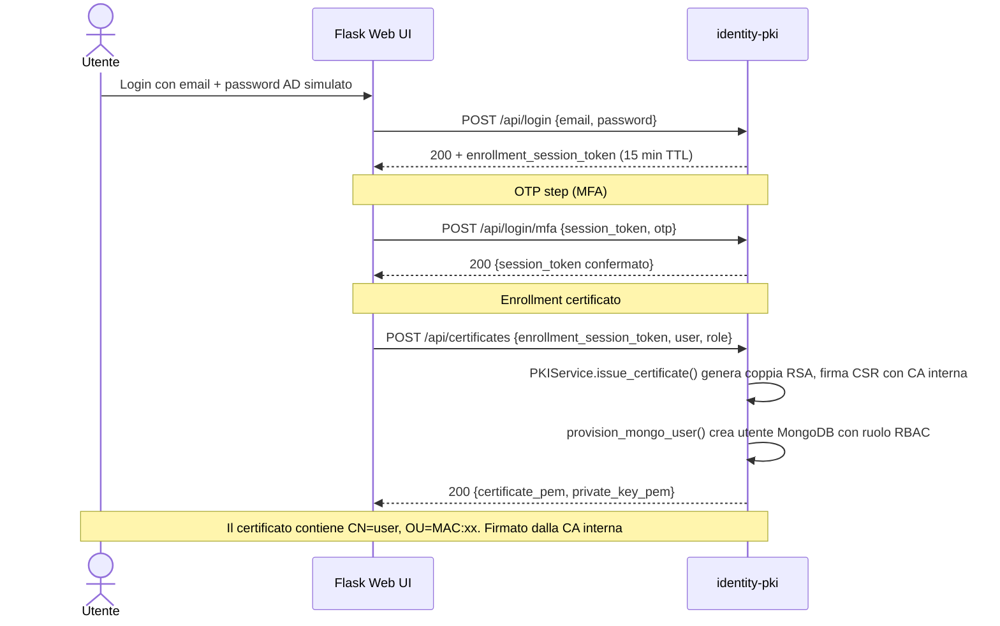
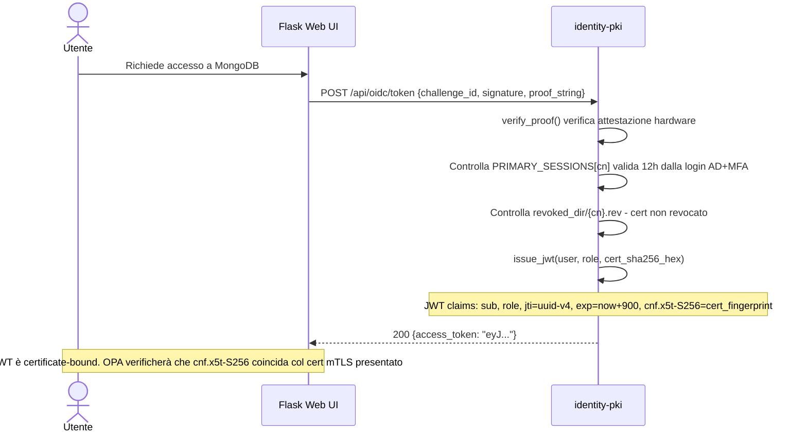
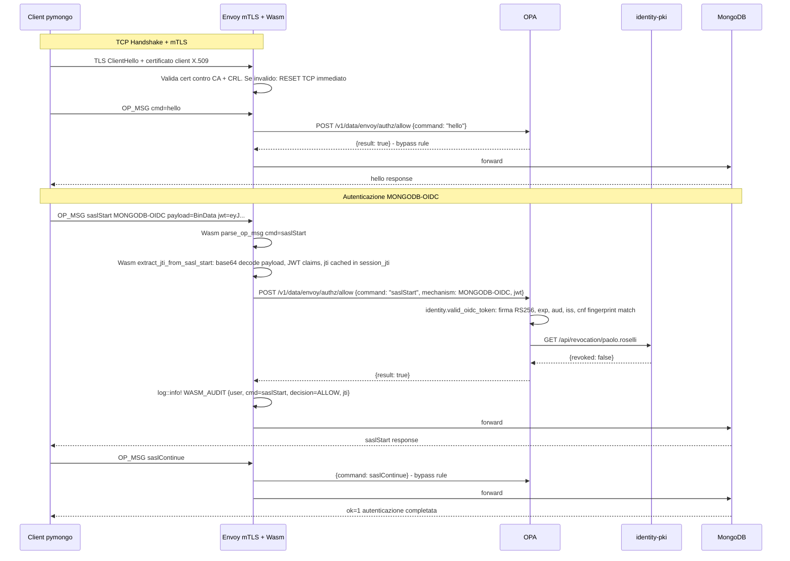
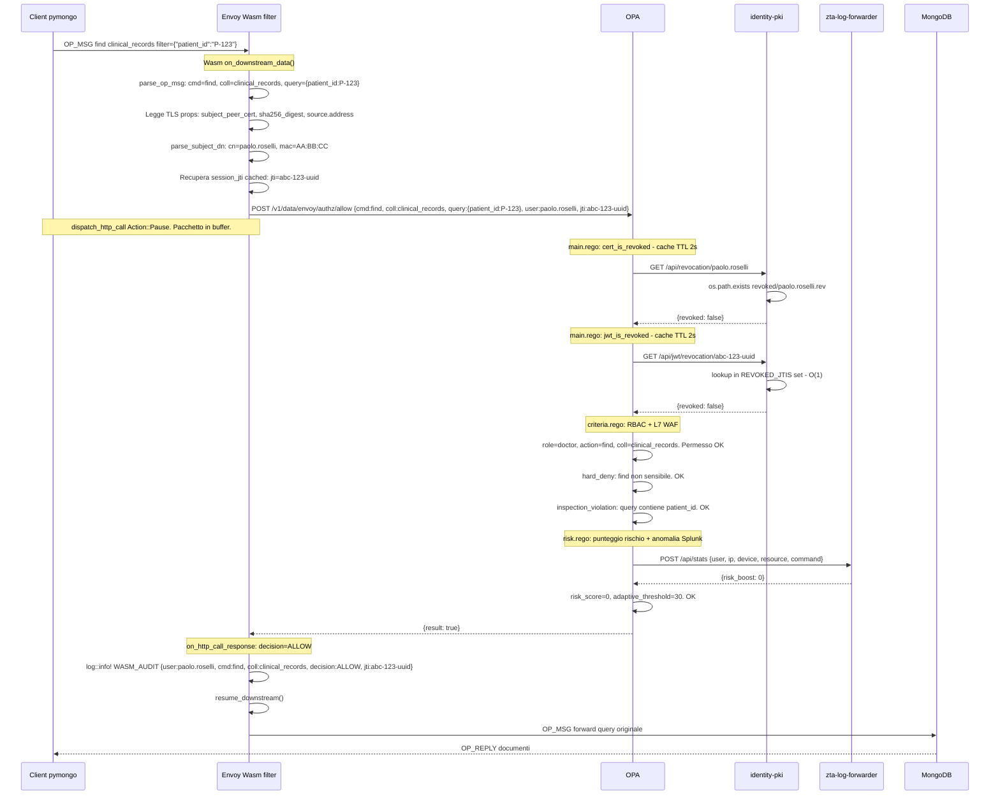
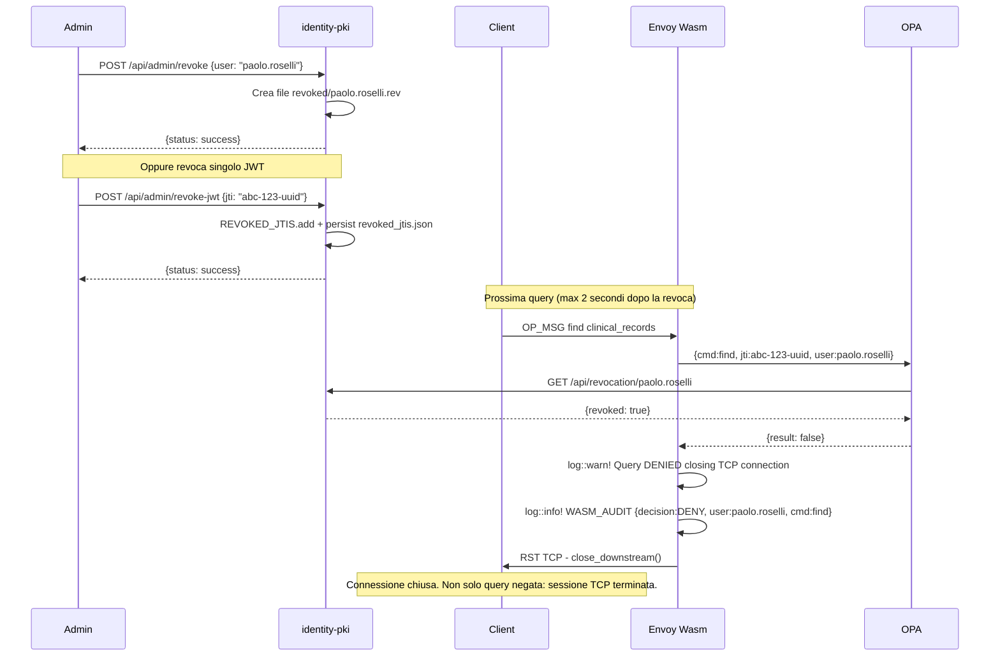
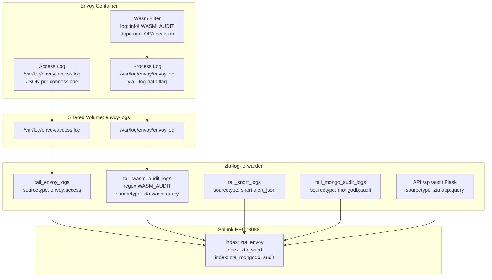

# Flusso delle Richieste — Sistema Zero Trust Architecture (ZTA)

Questo documento descrive nel dettaglio ogni chiamata che avviene nel sistema, dalla fase di login fino all'esecuzione di una query MongoDB, incluso il flusso di logging verso Splunk.

---

## Architettura dei componenti



---

## FASE 1 — Enrollment (una-tantum per dispositivo)

Prima di poter fare qualsiasi richiesta, l'utente deve ottenere un certificato X.509 che Envoy userà per autenticarlo a livello TLS (mTLS).



**Endpoint coinvolti:**
- `POST /api/login` → verifica credenziali AD, crea `ENROLLMENT_SESSIONS` entry
- `POST /api/login/mfa` → verifica OTP, marca sessione come MFA-verificata
- `POST /api/certificates` → emette certificato X.509, fa provisioning MongoDB

---

## FASE 2 — Ottenimento del JWT (OIDC Token)

Il JWT è il secondo fattore di autenticazione, **certificate-bound** (RFC 8705). Viene emesso solo dopo verifica hardware/biometrica e dura 15 minuti.



**Endpoint coinvolti:**
- `POST /api/oidc/token` → emette JWT RS256 con `jti` UUID univoco e `cnf` (cert binding)

---

## FASE 3 — Connessione MongoDB e Autenticazione OIDC (saslStart)

Il client apre una connessione TCP verso Envoy `:10000`. Tutto il traffico MongoDB passa per il Wasm filter prima di arrivare a MongoDB.



**Cosa fa il Wasm in saslStart:**
1. Parsa il pacchetto BSON OP_MSG (opcode 2013)
2. Estrae il JWT dal campo `payload` (BSON Binary → JSON → JWT string)
3. Decodifica il segmento claims del JWT (base64url)
4. Estrae e **mette in cache `jti`** nel campo `session_jti` della struct (per tutta la sessione TCP)
5. Invia tutto a OPA per validazione firma + binding certificato

---

## FASE 4 — Esecuzione di una Query MongoDB (mediazione continua)

Per **ogni singolo messaggio** MongoDB sulla connessione già aperta, il Wasm filter esegue un controllo OPA completo. Non basta che la connessione sia stata autenticata.



---

## FASE 5 — Caso di DENY (cert revocato o JWT nella denylist)



> [!IMPORTANT]
> La **chiusura TCP** (RST) è fondamentale: se il filtro negasse solo la singola query lasciando aperta la connessione, l'attaccante potrebbe continuare a inviare altri comandi nella stessa sessione.

---

## FASE 6 — Pipeline di logging verso Splunk



**Sourcetypes disponibili in Splunk:**

| Sourcetype | Contenuto | Frequenza |
|---|---|---|
| `envoy:access` | Dati connessione TCP: IP, bytes, durata, user, risk_score | Per connessione |
| `zta:wasm:query` | Ogni decisione OPA: cmd, collection, decision, jti, ctx_id | **Per singola query** |
| `zta:app:query` | Query eseguite da Flask /api/query con risultato e count | Per chiamata API |
| `snort:alert_json` | Alert IDS Snort 3 (NoSQLi signature, anomalie rete) | Per evento IDS |
| `mongodb:audit` | Audit nativo MongoDB (authenticate, find, update…) | Per operazione DB |
| `nftables:log` | Drop/accept kernel nftables | Per pacchetto filtrato |

---

## Tabella riepilogativa: chi fa cosa per ogni messaggio MongoDB

| Componente | Ruolo | Trigger |
|---|---|---|
| **TLS Inspector (Envoy)** | Valida certificato X.509, termina mTLS, estrae CN | Ogni nuova connessione TCP |
| **Wasm Filter** | Parsa OP_MSG BSON, estrae cmd/collection/query/JTI, invia a OPA | **Ogni pacchetto downstream** |
| **OPA** | Valuta RBAC + L7 WAF + risk score + revocation check | Ogni chiamata Wasm |
| **identity-pki `/api/revocation`** | Legge `.rev` file — O(1) disk stat | Ogni query OPA (cache 2s) |
| **identity-pki `/api/jwt/revocation`** | Lookup `REVOKED_JTIS` set — O(1) memory | Ogni query OPA (cache 2s) |
| **zta-log-forwarder `/api/stats`** | Query Splunk ultimi 15m per anomaly risk boost | Ogni query OPA (timeout 500ms) |
| **MongoDB** | Esegue la query, applica RLS views, restituisce documenti | Solo se Wasm+OPA → ALLOW |

---

## Latenza stimata per query

```
TCP/mTLS handshake (una-tantum per connessione):   5-10ms
Wasm BSON parse:                                   ~0.1ms
dispatch_http_call → OPA:                          ~2-5ms
  identity eval (firma JWT, CN, IP):               ~0.5ms
  cert_is_revoked (cache OPA 2s):                  ~0ms  (da cache)
  jwt_is_revoked  (cache OPA 2s):                  ~0ms  (da cache)
  risk.anomaly_risk → /api/stats → Splunk:         20-50ms (timeout 500ms)
OPA → Envoy response:                              ~1ms
Envoy → MongoDB → Client:                          variabile

Totale overhead ZTA per query (steady state):      ~25-70ms
```

> [!TIP]
> La cache OPA con `force_cache_duration_seconds: 2` garantisce che i controlli di revocation non aggiungano latenza nelle query rapide. La prima query di ogni "burst" di 2 secondi paga il costo HTTP verso il PKI; le successive usano la cache in-memory di OPA.
