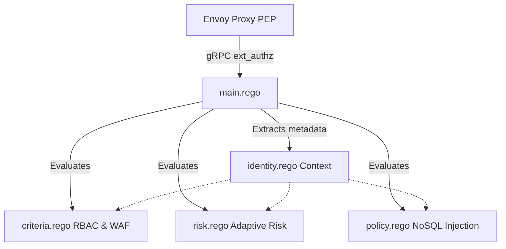

# Open Policy Agent (OPA) Policies Guide

This document describes the structure, responsibilities, and logic flow of the Rego policies defined in [opa/policies](file:///C:/Users/matti/Desktop/UNI/AdvancedCybersecurity/opa/policies). 

These policies form the PDP (Policy Decision Point) of our Zero Trust Architecture (ZTA), checking database and API requests proxied by Envoy (acting as the Policy Enforcement Point, or PEP).

---

## 🗺️ Policy Architecture Overview

The policy logic is split into five main functional packages, coordinated by a primary entry point:



---

## 📄 File-by-File Breakdown

### 1. [main.rego](file:///C:/Users/matti/Desktop/UNI/AdvancedCybersecurity/opa/policies/main.rego)
* **Namespace:** `envoy.authz`
* **Purpose:** The central coordinator and entry point for OPA query evaluations.
* **Key Responsibilities:**
  * Defines the main `allow` rule which requires passing RBAC criteria, keeping under the adaptive risk score threshold, and having no malicious payloads:
    ```rego
    allow if {
        criteria.criteria_allow
        risk.risk_score_allow
        not policy.is_malicious
    }
    ```
  * Declares **OPA bypass rules** for MongoDB infrastructure/system commands (e.g. `hello`, `ping`, `isMaster`, `saslContinue`, `buildInfo`) so standard connections can bootstrap without triggering full checks.
  * Formulates response headers (e.g., `x-zta-user`, `x-zta-risk-score`, `x-zta-decision`) returned to Envoy to decorate logs and metrics.

### 2. [identity.rego](file:///C:/Users/matti/Desktop/UNI/AdvancedCybersecurity/opa/policies/identity.rego)
* **Namespace:** `envoy.authz.identity`
* **Purpose:** Identity extraction, normalization, and cryptographic verification layer.
* **Key Responsibilities:**
  * **User Identity:** Extracts user names from OIDC tokens, certificate principal fields, payloads, or HTTP headers.
  * **Device Identity:** Inspects mTLS client certificates to extract TPM-bound MAC addresses from the `Subject.OrganizationalUnit`. Falls back to JA3 listener fingerprints if no certificate is present.
  * **Network Identity:** Identifies IP addresses and determines if the request originated from internal CIDR subnets.
  * **Role Mapping:** Statically maps known usernames to their RBAC roles (e.g., `doctor`, `billing_staff`, `auditor`, `receptionist`).
  * **OIDC Verification:** Performs cryptographic validation (`io.jwt.verify_rs256`) of federated OIDC JWT tokens against the PKI service JWKS endpoint, checking expiration and token binding (matching certificate fingerprint to token `cnf`).
  * **Metadata Normalization:** Translates MongoDB Row-Level Security (RLS) views back to their base collection names (e.g., `v_clinical_doctor` -> `clinical_records`), enabling uniform rule application.

### 3. [criteria.rego](file:///C:/Users/matti/Desktop/UNI/AdvancedCybersecurity/opa/policies/criteria.rego)
* **Namespace:** `envoy.authz.criteria`
* **Purpose:** Access Control Matrix (RBAC), Step-Up Authentication triggers, and basic WAF rules.
* **Key Responsibilities:**
  * **RBAC Permissons:** Holds the static matrix defining which roles can perform specific operations (`find`, `insert`, `update`, `delete`) on each normalized collection.
  * **Step-Up Authentication Trigger (`is_sensitive_action`):** Mandates a fresh OIDC token with a `step_up` claim for sensitive actions:
    * Any database `update` or `delete` operation.
    * Queries on `billing` targeting billing amounts strictly greater than 5000.
  * **L7 Content Inspection:** Enforces query sanitization constraints to block:
    * Write operations (`update`) on `clinical_records` that do not target a specific `patient_id`.
    * Database queries containing `$where` or `$function` operators in the `billing` collection.
    * Dumps of the `patients` collection (empty query `{}`) by non-admin roles.

### 4. [risk.rego](file:///C:/Users/matti/Desktop/UNI/AdvancedCybersecurity/opa/policies/risk.rego)
* **Namespace:** `envoy.authz.risk`
* **Purpose:** Computes a context-aware, adaptive risk score to enforce Zero Trust principles.
* **Key Responsibilities:**
  * **Risk Score Computation:** Calculates a normalized score (0 to 100) based on weighted dimensions:
    $$\text{Risk} = 0.30 \times \text{Identity} + 0.30 \times \text{Behavior} + 0.20 \times \text{Content} + 0.20 \times \text{Anomaly}$$
  * **Risk Dimensions:**
    * *Identity Risk:* Boosted for untrusted users (+30), devices without TPM (+20), or external networks (+15).
    * *Behavior Risk:* Determined by action type severity (e.g. `find` = 0, `delete` = 50, `drop`/`delete_database` = 100) and collection sensitivity (+15 for billing/clinical records).
    * *Content Risk:* Checks for dangerous or broad database queries.
    * *Anomaly Risk:* Makes a synchronous query to a local Splunk forwarder API to fetch historical risk telemetry.
  * **Adaptive Thresholds:** Defines dynamically assigned risk limits based on role and operation (e.g. `admin` gets a limit of 60, while sensitive operations like `delete` are constrained to a maximum threshold of 10).

### 5. [policy.rego](file:///C:/Users/matti/Desktop/UNI/AdvancedCybersecurity/opa/policies/policy.rego)
* **Namespace:** `envoy.authz.policy`
* **Purpose:** Specialized NoSQL Injection prevention scanner.
* **Key Responsibilities:**
  * Recursively crawls the MongoDB query document (`query_doc`) using OPA's built-in `walk` function.
  * Flags a request as `is_malicious` if it contains:
    * Blocked operators in keys (e.g., `$where`, `$function`, `$regex`, `$ne`, `$gt`).
    * Blocked operators in string values.
    * Dangerous expressions inside values (e.g., containing `sleep(` or `while(` patterns).

---

## 🧪 Testing and Verification

### [authz_test.rego](file:///C:/Users/matti/Desktop/UNI/AdvancedCybersecurity/opa/policies/authz_test.rego)
* **Namespace:** `envoy.authz`
* **Purpose:** Comprehensive unit test suite.
* **Coverage:** Includes unit tests mocking certificate claims, HTTP methods, risk metrics, and malicious payloads to verify:
  * Standard RBAC logic per role.
  * NoSQL injection detection.
  * OIDC JWT verification and token binding.
  * Multi-source threat intelligence alerts.

To run these unit tests inside the OPA container:
```bash
docker exec -t opa /opa test /policies -v
```
