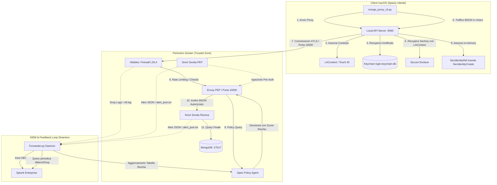

# Relazione Architetturale Finale: Zero Trust Architecture & Threat Detection

Questa relazione fornisce una panoramica integrata di fine progetto sull'intera architettura di sicurezza **Zero Trust (ZTA)** e **Threat Detection** implementata. La soluzione unisce la protezione crittografica ancorata all'hardware di macOS, la micro-segmentazione L3/L4 con nftables, l'ispezione di rete NIDS con Snort 3 e il calcolo dinamico del rischio adattivo con OPA e Splunk.

---

## 1. Architettura di Sistema Globale

Il sistema si fonda su un modello di sicurezza a più livelli (Defense in Depth) che si estende dallo spazio utente del client macOS fino al nucleo del database MongoDB all'interno del perimetro Docker.

---

## 2. Componenti Chiave dell'Architettura

### 2.1 ZTA Agent & Secure Enclave (macOS Client)
L'agente Swift nativo gestisce il ciclo di vita delle identità crittografiche ancorate all'hardware del Mac:
* **Generazione Chiave**: Le chiavi private EC P-256 vengono generate all'interno del **Secure Enclave Processor (SEP)** con politiche di accesso biometrico obbligatorio (`kSecAccessControlUserPresence`) e contrassegnate come non esportabili.
* **Enrollment**: Le informazioni hardware (UUID del Mac, CPU Model) vengono firmate dal SEP per attestare il possesso del dispositivo (Proof of Possession) e inviate alla PKI locale che rilascia un certificato X.509 legato alla chiave pubblica hardware.
* **Bypass del Prompt Multiplo (Touch ID Session Reuse)**: 
  * Il client MongoDB crea pool di connessioni parallele (3-4 connessioni simultanee), che causerebbero altrettanti prompt Touch ID consecutivi.
  * Abbiamo risolto questo problema integrando la funzione privata del Security Framework `SecIdentityCreate`. L'agente Swift interroga dapprima la chiave privata (`kSecClassKey`) legando il contesto LocalAuthentication attivo (`activeLAContext` ottenuto durante l'avvio della sessione). Successivamente, combina in memoria il certificato del Keychain con il riferimento della `SecKey` pre-autenticata.
  * Quando il modulo TLS di `Network.framework` effettua l'handshake per ciascuna connessione del pool, riutilizza la sessione biometrica del contesto crittografico memorizzato, richiedendo il Touch ID **esattamente una volta**.

### 2.2 Micro-segmentazione con nftables (L3/L4 Firewall)
Implementato all'interno del namespace di rete condiviso con Envoy per prevenire abusi di rete e attacchi volumetrici:
* **Default Drop**: Rifiuta per impostazione predefinita qualsiasi traffico non esplicitamente consentito.
* **Rate Limiting**: Limita le connessioni a Envoy a un massimo di 100 pacchetti al secondo (con burst a 200) sulla porta `10000`, e 50 pacchetti al secondo sulla porta di test `10001`, per mitigare attacchi di tipo Denial of Service (DoS) e scansioni massive delle porte.
* **SYN Flood Protection**: Limita i pacchetti TCP SYN a 200/secondo per prevenire l'esaurimento delle risorse di sistema.
* **Limitazione ICMP**: Previene il tunneling di dati o canali nascosti limitando i messaggi ping a 5 al secondo.
* **Egress Monitoring**: Logga tutti i pacchetti in uscita diretti verso indirizzi IP pubblici (non appartenenti a RFC1918) per identificare tentativi di esfiltrazione dati o callback di Command and Control (C2).

### 2.3 Network Intrusion Detection System (Snort 3)
Il rilevamento delle intrusioni è basato su una strategia **multi-sonda** per separare il traffico pre-autenticazione da quello post-autenticazione:
* **Sonda PEP (`snort-pep`)**: Posizionata nel namespace di Envoy. Rileva scansioni di porte, tentativi di injection NoSQL (stringhe contenenti `$where`, `$function` o exploit `$regex` ReDoS) e accessi non autorizzati all'interfaccia amministrativa di Envoy (`9901`).
* **Sonda Risorsa (`snort-resource`)**: Posizionata nel namespace di MongoDB. Ispeziona il traffico mTLS già decrittato ed autorizzato da Envoy e OPA. Rileva anomalie comportamentali (più di 100 connessioni in 10 secondi, indice di bulk exfiltration), comandi amministrativi non autorizzati (`dropDatabase`, `shutdown`, `dropUser`, `createUser`) e accessi diretti a collezioni sensibili (es. `system.users`). Segnala inoltre qualsiasi pacchetto diretto a MongoDB che non provenga dalla subnet interna di Envoy, identificando tentativi di bypass del proxy (PEP bypass).

### 2.4 Controllo Decisionale (OPA) & SIEM (Splunk)
Tutti i componenti loggano il proprio stato all'interno del sistema SIEM per creare un sistema a feedback dinamico:
1. I log di drop di `nftables` e gli alert JSON di `Snort 3` vengono letti in tempo reale da un demone python di inoltro ([forwarder.py](file:///Users/paoloroselli/Projects/AdvancedCybersecurity/scripts/opa_splunk_forwarder/forwarder.py)).
2. Il forwarder invia gli eventi a **Splunk Enterprise** tramite HTTP Event Collector (HEC).
3. Ogni 15 secondi, il forwarder interroga Splunk tramite API di ricerca per determinare se determinati indirizzi IP client abbiano generato allarmi o violazioni recenti.
4. I risultati vengono strutturati in tabelle di rischio e inviati a **Open Policy Agent (OPA)** (endpoint `/v1/data/splunk/nftables_alerts` e `snort_alerts`).
5. Quando OPA valuta una richiesta in [risk.rego](file:///Users/paoloroselli/Projects/AdvancedCybersecurity/opa/policies/risk.rego), somma il valore di anomalia al risk boost ricavato dagli allarmi del firewall e del NIDS. Se il valore cumulativo supera le soglie di tolleranza, l'accesso viene revocato al volo ed Envoy blocca la sessione client.

---

## 3. Matrice delle Protezioni per Livello

| Livello di Sicurezza | Componente Tecnologico | Minacce Mitigate | Politica / Meccanismo |
| :--- | :--- | :--- | :--- |
| **Livello Hardware** | Secure Enclave (macOS) | Furto di credenziali, clonazione identità | Chiavi EC P-256 non esportabili protette da Touch ID |
| **Livello di Rete L3/L4** | nftables (Envoy namespace) | SYN flood, DDoS, Port Scan, ICMP exfiltration, C2 callbacks | Default drop, rate limiting, egress filtering, stateful tracking |
| **Livello di Rete L7 (IDS)** | Snort 3 (Sonde PEP & Risorsa) | NoSQL Injection, ReDoS, lateral movement, bulk read exfiltration, comandi admin non autorizzati | Ispezione di firma e euristica del protocollo BSON/HTTP |
| **Livello di Accesso L7 (PEP)** | Envoy Sidecar Proxy | Accesso non autenticato, intercettazione dati | Decodifica protocollo BSON, terminazione mTLS client/server |
| **Livello Decisionale (PDP)**| Open Policy Agent (OPA) | Accessi fraudolenti da contesti anomali o ostili | Valutazione dinamica del rischio basata sui feed del SIEM |
| **Livello Risorsa** | MongoDB (Views & RBAC) | Accesso non autorizzato ai dati sanitari dei pazienti | Row-Level Security basata su viste differenziate per ruolo |

---

## 4. Conclusione e Stato della Sicurezza

L'integrazione di queste tecnologie realizza pienamente i requisiti di una moderna architettura Zero Trust in ambito enterprise e sanitario:
* L'identità utente non è un semplice segreto memorizzato, ma un'entità legata al pezzo fisico di silicio (Secure Enclave) sbloccato dall'impronta digitale dell'operatore (Touch ID).
* Le difese sono multilivello: prima che un malintenzionato possa anche solo tentare un exploit a livello applicativo, deve superare le protezioni antiscansione e anti-flooding di `nftables` e le sonde di rilevamento intrusioni di `Snort 3`.
* Le risposte agli incidenti non richiedono interventi manuali: l'integrazione SIEM Splunk-OPA crea un loop automatico e autonomo in grado di isolare e bloccare in tempo reale i client che manifestano pattern di traffico ostili o non conformi.
