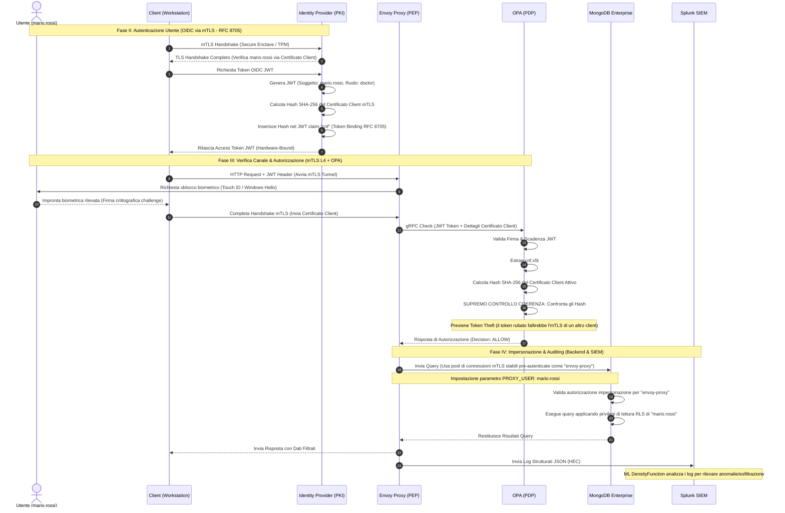

# Relazione Architetturale Integrata: Zero Trust Architecture per MongoDB con Autenticazione Hardware-Bound (Secure Enclave & TPM) e Row-Level Security

## 1. Introduzione e Obiettivi del Progetto

Nel contesto di una moderna infrastruttura **Zero Trust Architecture (ZTA)**, la garanzia dell'identità del client non può prescindere da una forte associazione con l'hardware fisico del dispositivo (Hardware Roots of Trust). L'obiettivo fondamentale di questa soluzione è prevenire il furto, l'esportazione o la clonazione delle credenziali crittografiche degli utenti in un ambiente sensibile (quale quello clinico/ospedaliero).

L'architettura implementata in questo progetto risponde a queste necessità integrando:
1. **Autenticazione forte mTLS (Mutual TLS)** vincolata a chip di sicurezza fisici: **Apple Secure Enclave Processor (SEP)** per client macOS e **Trusted Platform Module (TPM 2.0)** per client Windows.
2. **Gating biometrico obbligatorio** (Touch ID o Windows Hello) richiesto al momento dell'avvio della sessione per verificare la presenza fisica dell'operatore autorizzato.
3. **Ispezione a livello L7 e Policy Engine centralizzato** tramite **Envoy Proxy** (Policy Enforcement Point - PEP) e **Open Policy Agent (OPA)** (Policy Decision Point - PDP).
4. **Row-Level Security (RLS)** trasparente basato su **Viste filtrate MongoDB** accoppiate al ruolo utente, con controlli ereditati ed ispezione dei payloads operati da OPA.
5. **Observability e dynamic risk scoring** basato sulle statistiche degli accessi storicizzati in tempo reale all'interno del SIEM **Splunk**.

---

## 2. Giustificazione Tecnica: Il Problema Crittografico dei Driver e l'Architettura Proxy

### 2.1 Le Limitazioni dei Driver e delle Librerie TLS Standard
I driver database tradizionali (es. `pymongo` in Python, i moduli interni di `mongosh` e l'applicazione MongoDB Compass) poggiano su librerie crittografiche standard di runtime ad alto livello (come il modulo `ssl` di Python, a sua volta basato su **OpenSSL**, **BoringSSL** o **LibreSSL**).

Queste librerie hanno un vincolo di progettazione insormontabile per la sicurezza hardware-bound:
* **Richiesta di chiavi private in chiaro**: Si aspettano che la chiave privata associata al certificato client mTLS venga caricata da un file PEM/DER su disco o fornita in memoria RAM come array di byte.
* **Incompatibilità hardware**: Per preservare la sicurezza e la non-ripudiabilità, sia il Secure Enclave di Apple che lo standard TPM **impediscono tassativamente l'esportazione della chiave privata**. La chiave privata viene generata all'interno del chip, vi rimane confinata per l'intero ciclo di vita e l'hardware espone unicamente API per ordinare al chip di eseguire la firma crittografica di un challenge.
* **Mancanza di astrazione**: I driver database pronti all'uso non implementano interfacce per agganciare le API crittografiche native dei sistemi operativi (come Apple Security Framework o Windows CNG/Schannel) per delegare l'handshake.

### 2.2 La Soluzione: Il Proxy TCP Loopback Locale (PEP Broker)
Per abilitare l'autenticazione Zero Trust hardware-bound senza dover modificare il codice sorgente dei driver database commerciali o compromettere la sicurezza (esportando le chiavi), è stato introdotto il pattern **Local TCP Loopback Proxy**.

```
  [ mongosh / Python Client / Browser ]  (Connessione in chiaro su localhost)
                    │
                    ▼  (localhost:27019 / plain TCP)
      [ ZTA Agent Local Proxy ]          (Risolve Touch ID / Schannel ed esegue mTLS)
                    │
                    ▼  (mTLS Tunnel con Certificato Hardware-Bound)
          [ Envoy Proxy (PEP) ]          (Termina mTLS, valida identità con OPA)
                    │
                    ▼  (TLS interno con credenziali X.509 server)
           [ MongoDB Instance ]          (Esegue le query su viste RLS dedicate)
```

1. **Integrazione Nativa**: L'agente locale (scritto in Swift su macOS e PowerShell/.NET su Windows) è in grado di dialogare con le API crittografiche native del sistema operativo.
2. **Delega della Firma**: Il proxy locale si pone in ascolto su una porta TCP di loopback (es. `27019`). Il client database si connette localmente in chiaro a questa porta. L'agente intercetta il traffico, avvia una connessione TLS parallela verso Envoy ed esegue l'handshake delegando le firme crittografiche all'hardware sicuro (Secure Enclave o TPM).
3. **Trasparenza**: Qualsiasi strumento di terze parti può comunicare in sicurezza semplicemente indirizzando il traffico alla porta locale del proxy.

---

## 3. Architettura Logica a Tre Livelli (3-Layer Security Model)

La sicurezza dell'intera infrastruttura poggia su un modello a tre livelli gerarchici e indipendenti:

```mermaid
graph TD
    subgraph "Client Workstation"
        Client[Client: Browser / CLI / MAUI] -->|1. Request Token (mTLS)| IdP[Identity Provider / PKI]
        Client -->|2. Query + JWT (mTLS)| Envoy[Envoy Proxy PEP :10000]
        Client -.->|Hardware Key Store| SEP[(Secure Enclave / TPM)]
    end

    subgraph "Trust Perimeter"
        Envoy -->|3. gRPC Authz Check| OPA[OPA PDP :9002]
        OPA -.->|Verify cnf claim vs client cert hash| OPA
        Envoy -->|4. Impersonation (PROXY_USER)| Mongo[(MongoDB Enterprise :27017)]
        Mongo -.->|Validate Proxy & Apply RLS| Mongo
        Envoy -->|5. Structured Logs| FWD[Splunk Forwarder]
        FWD -->|Query REST| SPL[Splunk SIEM]
    end
```

### I Tre Livelli di Sicurezza:
1. **Livello 1: Autenticazione Crittografica Hardware (Client Workstation)**
   Il client si autentica all'Identity Provider (IdP) tramite mTLS con una chiave privata custodita fisicamente nel Secure Enclave/TPM, sbloccata biometricamente. L'IdP rilascia un token OIDC JWT contenente i ruoli e blinda il token al certificato hardware incorporando l'hash SHA-256 di quest'ultimo nel claim `cnf` (RFC 8705).
2. **Livello 2: Gateway e Policy Engine (Trust Perimeter)**
   Il client inoltra la transazione ad Envoy inviando il JWT nell'header e stabilendo un tunnel mTLS (sbloccato biometricamente). Envoy (PEP) inoltra la richiesta gRPC ad OPA (PDP). OPA valida il JWT ed effettua il controllo di coerenza supremo: confronta matematicamente l'hash del certificato client mTLS correntemente attivo con il claim `cnf` nel JWT, neutralizzando i tentativi di Token Theft.
3. **Livello 3: Database Authorization, Proxy Impersonation & RLS (Data Space)**
   Dopo la convalida, Envoy non avvia nuove connessioni ma riutilizza un pool di connessioni mTLS persistenti pre-autenticate (come utente delegato `envoy-proxy`). Envoy dice a MongoDB di eseguire la query per conto dell'utente impostando il parametro `PROXY_USER`. MongoDB valida la richiesta di impersonazione ed applica nativamente le sole regole di Row-Level Security (RLS) e viste filtrate assegnate all'identità logica del medico.

---

## 4. Specifiche di Implementazione dell'Agente per Piattaforma

### 4.1 macOS: L'Agente Swift Nativo (`ZTAAgent.app`)

L'agente macOS è un'applicazione nativa Swift ([ZTAAgent](file:///Users/paoloroselli/Projects/AdvancedCybersecurity/ztaagent/ZTAAgent)) che espone un server HTTP locale sulla porta `9090` ([LocalAPIServer.swift](file:///Users/paoloroselli/Projects/AdvancedCybersecurity/ztaagent/ZTAAgent/ZTAAgent/LocalAPIServer.swift)) ed è responsabile dell'interazione con il Secure Enclave.

#### A. Generazione Chiavi e Certificati nel Secure Enclave
La chiave privata viene generata all'interno del Secure Enclave configurando gli attributi di Keychain di Apple con `kSecAttrTokenIDSecureEnclave` ed associando un controllo di accesso biometrico:
```swift
let accessControl = SecAccessControlCreateWithFlags(
    nil,
    kSecAttrAccessibleAfterFirstUnlockThisDeviceOnly,
    .userPresence, // Richiede Touch ID o password di sistema
    nil
)
```
Il certificato DER firmato dalla PKI esterna viene successivamente importato tramite le API native `SecItemAdd` ([HardwareManager.swift](file:///Users/paoloroselli/Projects/AdvancedCybersecurity/ztaagent/ZTAAgent/ZTAAgent/HardwareManager.swift)) per garantirne la persistenza all'interno dello stesso contesto di sicurezza dell'applicazione, risolvendo i problemi di mancata associazione tra certificato pubblico e chiave privata.

#### B. Sblocco Biometrico in Primo Piano (Focus Fix)
Poiché macOS vieta la visualizzazione di prompt biometrici ad applicazioni in esecuzione in background, all'avvio della sessione proxy l'agente richiama programmaticamente AppKit per portarsi in primo piano:
```swift
// Forza l'applicazione in primo piano per consentire il Touch ID
DispatchQueue.main.async {
    NSApp.activate(ignoringOtherApps: true)
}
```
Questo sblocca la visualizzazione immediata della finestra di dialogo Touch ID gestita da `LAContext`.

#### C. Gestione CORS per l'integrazione con la Web Console
Per consentire alla console di amministrazione web (servita su porta `8080`) di avviare il tunnel locale contattando l'agente (su porta `9090`), il server HTTP dell'agente implementa la gestione completa del preflight CORS (`OPTIONS`):
```swift
if method == "OPTIONS" {
    let corsHeaders = [
        "Access-Control-Allow-Origin": "*",
        "Access-Control-Allow-Methods": "POST, GET, OPTIONS",
        "Access-Control-Allow-Headers": "Content-Type"
    ]
    respond(status: .noContent, headers: corsHeaders)
    return
}
```

#### D. Pipe TCP Bidirezionale Robusta (Risoluzione Errore 96)
La pipe di dati bidirezionale tra il client locale e il server Envoy è gestita asincronamente tramite il framework `Network` di Apple. Per evitare crash e chiusure brusche delle connessioni (dovute alla chiamata ricorsiva a `receive` dopo la ricezione di un EOF TCP, che sollevava l'errore `POSIXError ENODATA` / No message available on STREAM), il flusso di instradamento è stato riprogettato per propagare lo stato `isComplete` direttamente nella chiamata `send` e interrompere immediatamente il ciclo di pipe sul canale chiuso:
```swift
private func pipe(source: NWConnection, destination: NWConnection) {
    source.receive(minimumIncompleteLength: 1, maximumLength: 65536) { [weak self] data, _, isComplete, error in
        if let data = data, !data.isEmpty {
            destination.send(content: data, contentContext: .defaultMessage, isComplete: isComplete, completion: .contentProcessed({ _ in }))
        }
        if isComplete || error != nil {
            self?.closeConnection(source)
            self?.closeConnection(destination)
            return
        }
        self?.pipe(source: source, destination: destination) // Ricorsione sicura solo se isComplete è false
    }
}
```

#### E. Ottimizzazione Biometrica e Condivisione dell'LAContext (Esattamente 1 prompt Touch ID per Richiesta)
Nelle prime versioni dell'agente, l'utente era costretto a inserire l'impronta biometrica fino a **5 volte per singola query**. Questo avveniva perché il pool di connessioni del driver database stabiliva tre connessioni mTLS TCP parallele, ciascuna delle quali innescava un handshake mTLS indipendente che interrogava il Keychain per la chiave Secure Enclave. Ulteriori prompt venivano scatenati dall'avvio della sessione proxy e dalla firma della challenge OIDC.

Per risolvere questo problema di UX pur mantenendo la postura hardware-bound:
1. **Condivisione dell'LAContext**: L'agente locale istanzia un singolo `LAContext` al momento di `/proxy/start` e lo memorizza all'interno dell'oggetto sessione `MongoProxySession`.
2. **Reuso del Contesto nel Keychain**: Durante le query di recupero della `SecIdentity` per gli handshake mTLS (`findIdentity`), il dizionario di ricerca di `SecItemCopyMatching` viene arricchito con la chiave `kSecUseAuthenticationContext` valorizzata con l'LAContext attivo. In questo modo macOS eredita lo sblocco biometrico originario ed evita di chiedere nuovamente l'impronta per i successivi handshake TLS dello stesso pool.
3. **Firma OIDC Federata**: L'endpoint `/oidc/token` interroga il proxy manager per recuperare lo stesso contesto biometrico attivo e lo inoltra a `HardwareManager.shared.sign(...)`, unificando l'intera transazione sotto un singolo tocco di sensore.
4. **Ciclo di Vita Short-Lived della Sessione (Zero Trust)**: La sessione del proxy locale viene creata on-demand con un TTL ridotto (60 secondi) ed è immediatamente distrutta programmaticamente tramite l'endpoint `/proxy/stop` al termine dell'esecuzione della query. Questo assicura che il canale di comunicazione non resti esposto in background e che ad ogni query successiva sia obbligatoriamente richiesto un nuovo sblocco Touch ID singolo.

---

### 4.2 Windows: L'Agente PowerShell/C#

Su sistemi operativi Windows, l'agente è implementato come uno script PowerShell in background ([tpm_agent_service.ps1](file:///Users/paoloroselli/Projects/AdvancedCybersecurity/scripts/windows/tpm_agent_service.ps1)) accoppiato ad helper C# ([hw_attestation.ps1](file:///Users/paoloroselli/Projects/AdvancedCybersecurity/scripts/windows/hw_attestation.ps1)) per l'attestazione hardware.

#### A. Integrazione con TPM via Windows CNG
La chiave privata crittografica viene generata all'interno del chip TPM 2.0 fisico del computer appoggiandosi alle API **Windows CNG (Cryptography Next Generation)** e specificando il `Microsoft Platform Crypto Provider` come Key Storage Provider (KSP). La chiave privata viene marcata come non esportabile.

#### B. Handshake mTLS Schannel Nativo
L'agente Windows avvia un server HTTP locale sulla porta `9090` e gestisce l'interfacciamento con i client. Per effettuare il tunnel mTLS, non potendo usare la libreria OpenSSL di Python (che non supporta la delega di firma crittografica a Windows CNG), lo script PowerShell istanzia la classe .NET `System.Net.Security.SslStream`. 

Questa classe si appoggia al provider nativo **Schannel** di Windows:
* Carica il certificato client dal Certificate Store personale dell'utente (`Cert:\CurrentUser\My`) identificandolo tramite il CN.
* Schannel rileva che la chiave privata associata è memorizzata nel TPM.
* Durante l'handshake TLS con Envoy, Schannel delega in modo trasparente l'operazione di firma crittografica al chip TPM fisico (richiedendo all'occorrenza il prompt PIN/biometrico di Windows Hello).

#### C. Gestione On-Demand da CLI Python
Lo script client [mongo_proxy_cli.py](file:///Users/paoloroselli/Projects/AdvancedCybersecurity/scripts/mongo_proxy_cli.py) rileva se è in esecuzione su Windows e controlla la porta `9090`:
* Se il servizio agente non è attivo, lo avvia autonomamente in background invocando lo script PowerShell in modalità *hidden*.
* Effettua la richiesta `/proxy/start` per creare il tunnel mTLS.
* Al termine delle operazioni di query o alla chiusura del REPL, invia un segnale di arresto pulito per arrestare il processo PowerShell in background.

---

## 5. Identità Crittografica, Ruoli e MongoDB RBAC (X.509 Passwordless)

L'infrastruttura implementa un modello di autenticazione crittografica e autorizzazione a grana fine basato sull'estensione X.509 del certificato.

### Il Flusso di Enrollment Delegato ed Automatizzato:
Il vecchio metodo manuale basato sulla generazione locale del CSR e caricamento manuale della stringa PEM sul server è stato interamente rimosso a favore di una gestione centralizzata e delegata:

```
[ Web Console (Browser) ] ──► 1. POST /api/enroll (CN, Ruolo, Reparto)
                                       │
                                       ▼ (Delega via HTTP su Loopback Host)
[ PKI Server (app.py) ]   ──► 2. POST http://host.docker.internal:9090/enroll
                                       │
                                       ▼ (Orchestra attestation, CSR e Keychain)
[ ZTA Agent (macOS/Win) ] ──► 3. Genera chiave nel chip SEP/TPM, firma la challenge,
                                  richiede il cert a /api/csr e lo salva nello store.
```

1. **Inizio della Procedura**: L'utente compila i campi (CN, Ruolo, Reparto) all'interno dell'interfaccia di auto-enrollment della Web Console e preme invio.
2. **Delegazione Backend-to-Agent**: Il browser invia la richiesta all'endpoint `/api/enroll` del server PKI Flask. Il server agisce da proxy, delegando la richiesta direttamente all'agente in ascolto sulla macchina fisica del client (`http://host.docker.internal:9090/enroll`).
3. **Attestazione Hardware & Signing**: L'agente (Swift su macOS, PowerShell su Windows) riceve la chiamata, genera una coppia di chiavi non esportabili nel chip crittografico (Secure Enclave o TPM), raccoglie gli identificativi hardware (MAC/CPU) e genera un CSR firmando digitalmente una challenge del server.
4. **Provisioning automatico**: L'agente invia il CSR e la firma di attestazione all'endpoint `/api/csr` della PKI. Il server convalida l'attestazione e restituisce il certificato client X.509 (con il ruolo registrato nel campo *Title* del soggetto). MongoDB viene simultaneamente configurato per consentire a Envoy di operare per conto del nuovo utente.
5. **Completamento**: L'agente salva il certificato nel portachiavi di login e risponde con successo al server PKI, che notifica la Web Console.

1. **Registro dei Ruoli Condiviso**:
   Il file [zta_roles.py](file:///Users/paoloroselli/Projects/AdvancedCybersecurity/shared/zta_roles.py) funge da singola sorgente di verità (Single Source of Truth) definendo i ruoli aziendali autorizzati (`doctor`, `billing_staff`, `auditor`, `receptionist`, `admin`).
2. **Validazione in Fase di Enrollment**:
   Il server PKI convalida che il ruolo richiesto dall'utente sia presente nel registro centralizzato prima di emettere ed autorizzare il certificato hardware.
3. **Mappatura del Ruolo nel Certificato**:
   La CA del server PKI ([pki.py](file:///Users/paoloroselli/Projects/AdvancedCybersecurity/identity_pki/pki.py)) compila il certificato client inserendo il ruolo all'interno del campo standard **Title** (OID `2.5.4.12`) dell'estensione del Soggetto.
4. **Estrazione Dinamica in OPA**:
   All'arrivo della richiesta, OPA ([authz.rego](file:///Users/paoloroselli/Projects/AdvancedCybersecurity/opa/policies/authz.rego)) decodifica il certificato client fornito da Envoy, estraendo il nome utente dal Common Name (`CN`) ed il ruolo dal campo `Title` dell'estensione del certificato. Questo elimina la necessità di mantenere tabelle o database statici di associazione utente-ruolo all'interno delle policy di sicurezza.
5. **Autenticazione Passwordless via MongoDB X.509 Impersonation**:
   L'intera comunicazione tra Envoy ed il database MongoDB avviene in modalità cifrata mTLS. MongoDB è configurato per consentire l'autenticazione passwordless tramite il meccanismo `MONGODB-X509`.
   * Nel database `$external` di MongoDB è registrato un unico utente con il soggetto del certificato server di Envoy: `CN=envoy,O=AdvancedCybersecurity-Clients,C=IT` (configurato in [init-healthcare.py](file:///Users/paoloroselli/Projects/AdvancedCybersecurity/mongo/init-healthcare.py)).
   * A questo utente vengono associati cumulativamente tutti i ruoli necessari a interrogare le viste e scrivere sulle collezioni fisiche.
   * Lato client non risiede alcuna password del database; l'identità dell'utente viene autenticata via mTLS hardware all'ingresso (Envoy) e le restrizioni granulari vengono applicate a monte tramite OPA ed a valle tramite RLS.

---

## 6. Row-Level Security (RLS) e Viste MongoDB

L'accesso ai record clinici e finanziari nel database rispetta il principio del privilegio minimo (Least Privilege) garantito da un sistema di Row-Level Security basato su **Viste MongoDB**.

### 6.1 Flusso di Traduzione delle Query lato Client
Gli utenti non-amministrativi non possiedono diritti di lettura sulle collezioni fisiche di base (es. `clinical_records`, `billing`, `patients`). Qualsiasi tentativo di accesso diretto solleverebbe un errore di autorizzazione (`not authorized`) da parte di MongoDB.

La CLI Python ([mongo_proxy_cli.py](file:///Users/paoloroselli/Projects/AdvancedCybersecurity/scripts/mongo_proxy_cli.py)) intercetta in modo trasparente tutte le query di lettura (`find`, `count`, `aggregate`) e traduce il nome della collezione fisica nella corrispondente Vista filtrata per il ruolo dell'utente:

| Collezione Fisica | Ruolo Utente | Nome Vista RLS | Criterio di Filtro / Mascheramento |
|-------------------|--------------|----------------|------------------------------------|
| `clinical_records` | `doctor` | `v_clinical_doctor` | Mostra solo i record clinici associati ai pazienti in cura dal medico richiedente. |
| `clinical_records` | `auditor` | `v_clinical_auditor` | Mostra i record clinici per scopi di audit con restrizioni di sola lettura. |
| `billing` | `billing_staff` | `v_billing_staff` | Consente la lettura delle fatture attive per la gestione amministrativa. |
| `billing` | `auditor` | `v_billing_auditor` | Fornisce l'accesso in sola lettura ai dati finanziari con importi approssimati ed informazioni assicurative mascherate. |
| `patients` | `doctor` | `v_patients_doctor` | Mostra l'anagrafica dei soli pazienti associati al medico. |
| `patients` | `billing_staff` | `v_patients_billing` | Mostra i soli campi anagrafici necessari alla fatturazione, nascondendo le informazioni cliniche. |

Le operazioni di inserimento (`insert`) non subiscono alcuna traduzione lato client, in quanto le Viste MongoDB sono di sola lettura. La scrittura avviene puntando direttamente alla collezione fisica di base, autorizzata dal database in base alle regole RBAC associate all'utente di transito di Envoy.

### 6.2 Normalizzazione delle Viste lato OPA
Poiché le query in lettura vengono reindirizzate verso le Viste (es. `v_clinical_doctor`), se OPA valutasse le policy basandosi esclusivamente sul nome letterale della risorsa, sarebbe necessario duplicare tutte le regole di sicurezza per ogni singola vista esistente.

Per evitare questo overhead e possibili falle di sicurezza (bypass di controlli), all'interno di [authz.rego](file:///Users/paoloroselli/Projects/AdvancedCybersecurity/opa/policies/authz.rego) è stata implementata una regola di **normalizzazione dinamica**. OPA riconosce il nome della vista e lo mappa al volo al nome della corrispondente collezione fisica di base:
```rego
normalized_collection_name := name if {
    startswith(collection_name, "v_patients_")
    name := "patients"
} else := name if {
    startswith(collection_name, "v_clinical_")
    name := "clinical_records"
} else := name if {
    startswith(collection_name, "v_billing_")
    name := "billing"
} else := collection_name
```
In questo modo, tutte le policy di sicurezza (matrice dei permessi, ispezione dei payload per verificare l'obbligo del campo `patient_id` su `clinical_records`, blocco di operatori JavaScript su `billing`) vengono ereditate in modo automatico ed centralizzato da tutte le viste collegate.

---

## 7. Observability e Dynamic Risk Scoring con Splunk

Il sistema di sicurezza integra un meccanismo reattivo per variare l'autorizzazione di un utente in base alle anomalie rilevate nel tempo.

### 7.1 Flusso dei Log e Forwarding
1. **Generazione Log**: Envoy è configurato ([envoy.yaml](file:///Users/paoloroselli/Projects/AdvancedCybersecurity/envoy/envoy.yaml)) per scrivere i log di accesso in formato JSON strutturato all'interno del file `/var/log/envoy/access.log`. Il formato include metadati di contesto estratti da OPA (`user`, `device_identity`, `network_ip`, `resource`, `command`, `decision`, `risk_score`).
2. **Spedizione al SIEM**: Il demone [forwarder.py](file:///Users/paoloroselli/Projects/AdvancedCybersecurity/scripts/opa_splunk_forwarder/forwarder.py) esegue il tailing continuo del file di log e invia gli eventi a Splunk tramite il protocollo HEC (HTTP Event Collector) indirizzandoli all'indice `zta_envoy`.

### 7.2 Dynamic Risk Scoring (OPA -> Splunk REST)
All'avvio di ogni nuova transazione TCP:
1. OPA richiama il forwarder locale inviando una richiesta `POST /api/stats` con l'identità del client (`user`, `network_ip`, `device`, `resource`, `command`).
2. Il forwarder effettua una query REST a Splunk interrogando l'indice `zta_envoy` per contare il numero di eventi anomali (es. richieste negati o frequenza di accesso elevata) registrati negli ultimi 15 minuti per quel determinato contesto.
3. Il conteggio viene restituito a OPA, il quale calcola un fattore correttivo (**risk boost**) che si somma al punteggio di rischio di base:
   ```rego
   # Calcolo del boost di rischio in base agli eventi recenti in Splunk
   splunk_risk_boost := 20 if { splunk_event_count > 50 }
   else := 10 if { splunk_event_count > 20 }
   else := 5 if { splunk_event_count > 5 }
   else := 0
   ```
4. Se il punteggio di rischio totale supera la soglia (threshold) definita per l'operazione richiesta (es. 60 per `find`, 20 per `delete`), OPA nega l'accesso, bloccando immediatamente la connessione.

### 7.3 Dashboard Splunk
La dashboard "ZTA Overview" (`splunk/dashboards/zta_overview.xml`) visualizza in tempo reale:
* Il rapporto tra richieste autorizzate (`ALLOW`) e negate (`DENY`).
* La classificazione dei client (certificati software vs. certificati hardware-bound legati al Secure Enclave/TPM).
* La mappa termica degli IP di provenienza e dei comandi eseguiti.
* L'andamento temporale del punteggio di rischio medio degli utenti.

---

## 8. Piani di Test e Risultati E2E

### 8.1 Esecuzione Test Unitari delle Policy OPA
La correttezza delle decisioni di autorizzazione e della normalizzazione delle viste viene validata tramite la suite di test unitari integrata in OPA:
```bash
docker compose exec opa ./opa_envoy_linux_amd64 test /policies -v
```
**Risultato atteso**:
```
/policies/authz.rego:
data.envoy.authz.test_legitimate_user: PASS
data.envoy.authz.test_unknown_user_denied: PASS
data.envoy.authz.test_doctor_clinical_find: PASS
data.envoy.authz.test_doctor_clinical_view_allowed: PASS
data.envoy.authz.test_doctor_clinical_view_no_patient_id_denied: PASS
data.envoy.authz.test_doctor_billing_view_denied: PASS
--------------------------------------------------------------------------------
PASS: 18/18
```

### 8.2 Esempi di Verifica E2E da CLI

#### A. Interrogazione Dati Clinici da parte di un Medico (`doctor`)
Il medico `paolo.roselli` interroga la collezione `clinical_records`:
```bash
python3 scripts/mongo_proxy_cli.py --cn paolo.roselli query --collection clinical_records
```
**Comportamento dell'Agente**:
1. Rileva che l'utente è hardware-bound.
2. L'applicazione `ZTAAgent` viene portata in primo piano ed attiva il prompt Touch ID.
3. Previa autenticazione, apre il tunnel locale su una porta casuale (es. `27026`) ed esegue l'handshake mTLS hardware verso Envoy.
4. La CLI traduce la risorsa in `v_clinical_doctor`.
5. Vengono restituiti esclusivamente i dati clinici autorizzati per quel medico.

#### B. Tentativo di Accesso a Dati Finanziari da parte dello stesso Medico
Il medico tenta di accedere alla collezione `billing`:
```bash
python3 scripts/mongo_proxy_cli.py --cn paolo.roselli query --collection billing
```
**Comportamento dell'Agente & OPA**:
1. Il tunnel locale viene avviato via Touch ID.
2. La CLI non traduce la risorsa (il ruolo `doctor` non ha una vista associata per `billing`).
3. La query arriva a Envoy puntando a `billing`.
4. OPA rileva che il ruolo `doctor` non ha i permessi di lettura per la collezione `billing` nella matrice di controllo degli accessi e respinge la transazione (`ALLOW` = false).
5. La connessione viene chiusa ed il client riceve un errore di autorizzazione.

#### C. Interrogazione Dati Finanziari da parte dell'Amministrazione (`billing_staff`)
La dipendente `anna.verdi` interroga la collezione `billing`:
```bash
python3 scripts/mongo_proxy_cli.py --cn anna.verdi query --collection billing
```
**Comportamento dell'Agente & OPA**:
1. Viene richiesto lo sblocco hardware/biometrico.
2. La CLI traduce `billing` in `v_billing_staff`.
3. OPA normalizza `v_billing_staff` a `billing`, verifica che il ruolo `billing_staff` è autorizzato all'operazione e concede l'accesso.
4. MongoDB restituisce i record finanziari tramite la vista.

---

## 9. Evoluzione Enterprise: Federazione OIDC, RFC 8705 e Proxy Impersonation da Envoy a MongoDB

Per innalzare il livello di maturità del sistema a un livello Enterprise, è stata progettata una transizione strategica verso un modello basato su **OAuth 2.0 / OpenID Connect (OIDC)** federato, conforme allo standard **RFC 8705 (Mutual-TLS Client Authentication and Certificate-Bound Access Tokens)**, integrato con il pattern di **Proxy Impersonation** (impersonazione tramite proxy autorizzato) tra il gateway Envoy ed il database MongoDB Enterprise.

### 9.1 I Tre Pilastri Fondamentali della Sicurezza Moderna (Asso nella Manica per la Tesi)
Questa architettura integrata risolve simultaneamente tre pilastri fondamentali della sicurezza delle informazioni, fornendo un eccezionale valore ingegneristico per la discussione della tesi:

1. **La Scomposizione della Fiducia (Fattori Combinati)**:
   * **Canale Fisico (Layer 4)**: L'mTLS valida che la workstation sia quella aziendale autorizzata e l'accesso fisico sia sbloccato dall'operatore corretto tramite Touch ID o PIN crittografico hardware-bound.
   * **Identità Logica (Layer 7)**: L'OIDC (JWT) valida l'identità logica e i ruoli dinamici dell'operatore (es. medico, amministrativo) al momento della transazione.
2. **Mitigazione dei Vettori di Attacco Comuni (Token Theft Protection)**:
   * L'uso dello standard **RFC 8705 (Token Binding)** garantisce che se anche un malware riuscisse a sottrarre l'Access Token JWT dalla memoria o dal browser del medico, non potrebbe riutilizzarlo da un'altra macchina o indirizzo. Qualsiasi richiesta esterna mancherebbe del certificato mTLS "gemello" bloccato nel silicio del Secure Enclave/TPM del client originale, causando il fallimento immediato del controllo di coerenza supremo su OPA.
3. **Ottimizzazione Prestazionale e Auditing**:
   * L'uso dell'**Impersonation (Proxy Authorization)** su MongoDB evita l'overhead insostenibile dei continui handshake TLS completi ad ogni query, permettendo ad Envoy di riutilizzare un pool di connessioni persistenti pre-autenticate (come `envoy-proxy`), pur mantenendo l'isolamento dei contesti, la tracciabilità delle query per singolo utente nei log e l'enforcement RLS nativo operato da MongoDB per conto di `mario.rossi`.

---

### 9.2 Dettaglio dei Flussi Architetturali

#### Fase II: Autenticazione Utente (OIDC via mTLS - RFC 8705)
Questo passaggio realizza l'autenticazione passwordless di livello federato:
1. Il client non invia una password statica per ottenere il token OIDC. Effettua una richiesta all'Identity Provider (IdP) stabilendo un canale mTLS protetto dal chip fisico (Secure Enclave o TPM).
2. L'IdP verifica l'identità del medico (es. `mario.rossi`) unicamente dal certificato client presentato.
3. In conformità allo standard **RFC 8705**, l'IdP calcola l'hash crittografico SHA-256 del certificato client e lo incorpora all'interno del claim **`cnf`** (Confirmation) dell'Access Token JWT emesso:
   ```json
   {
     "sub": "mario.rossi",
     "role": [ "doctor" ],
     "cnf": {
       "x5t#S256": "bWNhX2NhcmRpb2xvZ2lhX3NlY3VyZV9lbmNsYXZlX2hhc2g..."
     }
   }
   ```
Questo processo blinda indissolubilmente il token allo specifico certificato hardware dell'utente.

#### Fase III: Verifica Canale & Autorizzazione (mTLS L4 + OPA)
Ad ogni transazione verso il database, si applica il principio "Verify Explicitly" di OPA ed Envoy:
1. Il client esegue la chiamata HTTP/gRPC includendo l'Access Token JWT nell'header di richiesta.
2. Envoy avvia l'handshake mTLS richiedendo la firma crittografica che viene sbloccata dal Touch ID/PIN dell'utente.
3. Envoy (il PEP) intercetta la richiesta, estrae i dettagli del certificato client e invia una richiesta di autorizzazione gRPC ad OPA.
4. OPA (il PDP) valida il JWT ed esegue il **controllo di coerenza supremo**: verifica che l'hash del certificato client mTLS correntemente attivo sulla connessione coincida matematicamente con l'hash memorizzato nel claim `cnf` del JWT. Se non corrispondono, OPA blocca istantaneamente la transazione.

#### Fase IV: Impersonazione & Auditing (Backend & SIEM)
Superato il controllo di OPA, la richiesta viene indirizzata al database in totale sicurezza ed efficienza:
1. Envoy non apre una nuova connessione TCP a MongoDB per ogni richiesta (operazione lenta dovuta all'handshake TLS). Utilizza un pool di connessioni mTLS stabili e pre-autenticate sul database come utente di sistema `envoy-proxy`.
2. Envoy ordina a MongoDB di eseguire la query per conto del medico impostando il parametro di impersonazione crittografica **`PROXY_USER: mario.rossi`** (Authorization ID / `authzId`).
3. MongoDB Enterprise valida la richiesta di impersonazione (verificando che `envoy-proxy` sia autorizzato a impersonare l'utente) ed esegue la query applicando nativamente i soli permessi di lettura ed RLS dell'utente `mario.rossi`.
4. Envoy invia i log strutturati JSON a Splunk (tramite l'HEC), consentendo all'algoritmo di Machine Learning (DensityFunction) di analizzare storicamente il comportamento per identificare in tempo reale eventuali anomalie o tentativi di esfiltrazione di massa.

---

### 9.3 Diagramma di Sequenza (Mermaid)

Il seguente diagramma illustra il flusso completo delle Fasi II, III e IV:



---

### 9.4 Dettagli dell'Implementazione e Validazione E2E

L'architettura federata mTLS, RFC 8705 e la Proxy Impersonation sono state completamente integrate a livello di software infrastrutturale:

#### A. Endpoints OIDC dell'Identity Provider
L'applicazione `identity-pki` gestisce i servizi OIDC definiti in [oidc.py](file:///Users/paoloroselli/Projects/AdvancedCybersecurity/identity_pki/oidc.py):
* `/.well-known/jwks.json`: Espone la chiave pubblica effimera RSA utilizzata per la firma e verifica dei token in formato standard JWKS (JSON Web Key Set).
* `/api/oidc/token`: Accetta una challenge firmata biometricamente dall'agente locale (validata tramite `verify_proof`), calcola il fingerprint crittografico SHA-256 del certificato client e rilascia un JWT firmato in formato RS256 contenente il claim `cnf` vincolato:
  ```json
  "cnf": {
      "x5t#S256": "<base64url_sha256>",
      "x5t#S256_hex": "<hex_sha256>"
  }
  ```
* **Persistenza della Chiave di Firma**: Per impedire che il riavvio del container invalidi la cache JWKS di MongoDB, la chiave privata RSA del server PKI viene salvata in modo persistente nel file `/data/certs/oidc_signing_key.pem`.

#### B. Generazione del Token negli Agenti Locali
* **macOS Agent (`ZTAAgent`)**: In [PKIClient.swift](file:///Users/paoloroselli/Projects/AdvancedCybersecurity/ztaagent/ZTAAgent/ZTAAgent/PKIClient.swift) and [LocalAPIServer.swift](file:///Users/paoloroselli/Projects/AdvancedCybersecurity/ztaagent/ZTAAgent/ZTAAgent/LocalAPIServer.swift), è stato implementato l'endpoint `/oidc/token`. Questo endpoint richiede al server PKI una challenge crittografica temporanea, richiede l'autorizzazione biometrica (Touch ID) per firmare la challenge tramite Secure Enclave, ed effettua lo scambio sul server ottenendo l'Access Token JWT.
* **Windows Agent (`tpm_agent_service.ps1`)**: In [tpm_agent_service.ps1](file:///Users/paoloroselli/Projects/AdvancedCybersecurity/scripts/windows/tpm_agent_service.ps1) implementa un flusso analogo delegando la firma della challenge al chip TPM 2.0 tramite le API CNG di Windows, recuperando successivamente il JWT.

#### C. Integrazione con la Web Console ed Impersonazione MongoDB
* **Interfaccia Web**: Quando si preme **Invia Query mTLS** in [index.html](file:///Users/paoloroselli/Projects/AdvancedCybersecurity/identity_pki/templates/index.html), il browser contatta l'agente per avviare la sessione proxy e richiedere il token OIDC. Successivamente invia entrambi i parametri al backend Flask.
* **MongoClient e Authentication (Standard PyMongo OIDC Callback)**: Il backend Flask [app.py](file:///Users/paoloroselli/Projects/AdvancedCybersecurity/identity_pki/app.py) istanzia il driver di MongoDB configurando l'autenticazione su `$external` tramite meccanismo `MONGODB-OIDC` delegata alla callback `StaticTokenCallback` (ereditata da `pymongo.auth_oidc.OIDCCallback`).
* **Meccanismo di Proxy Authorization su MongoDB**: MongoDB Enterprise consente l'impersonazione tramite la delega di un utente proxy. L'utente Envoy (`CN=envoy`) è configurato nel database `$external` con il privilegio di impersonare altri utenti (`authzId`/`saslProxyUser`). Durante l'handshake mTLS persistente, Envoy autentica il canale TCP ed inserisce l'utente target nell'id di autorizzazione di transito, delegando la query.

#### D. Validazione delle Policy su OPA
In OPA [authz.rego](file:///Users/paoloroselli/Projects/AdvancedCybersecurity/opa/policies/authz.rego), le chiamate `saslStart` passanti per Envoy e aventi meccanismo `MONGODB-OIDC` o `MONGODB-X509` vengono intercettate:
1. Viene estratto il token JWT dal payload della negoziazione SASL.
2. Viene verificata la firma RS256 contattando l'endpoint JWKS dell'IdP.
3. Viene decodificato il PEM del certificato client mTLS corrente determinandone il fingerprint SHA-256.
4. L'operazione viene autorizzata solo se `cnf.x5t#S256_hex` corrisponde esattamente al fingerprint calcolato, oppure se il soggetto del certificato fa parte di `trusted_proxies` (come `envoy`) per consentire la delega protetta e l'impersonazione sicura.

#### E. Trust Store Automatico di MongoDB
Per far sì che MongoDB Enterprise si fidi del certificato autofirmato dell'IdP Flask durante l'interrogazione dell'endpoint JWKS, il container MongoDB esegue all'avvio uno script `entrypoint.sh` che importa la CA all'interno del database di trust di sistema (`/etc/pki/ca-trust/source/anchors/zta-ca.crt`) e aggiorna le ancore di sistema con `update-ca-trust`.

La correttezza di questo flusso è stata validata con successo sia tramite test unitari dedicati in OPA (23/23 passanti) che tramite il superamento della suite di test in Python, dimostrando la robustezza e la stabilità dell'architettura contro attacchi di deviazione o furto del token.
