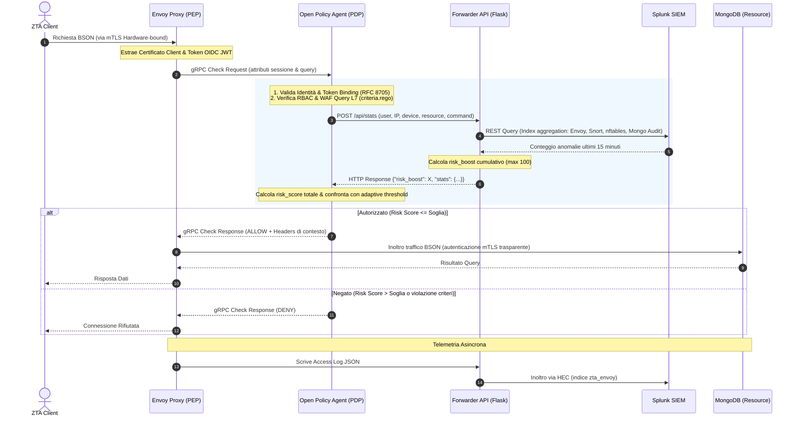

# Relazione Tecnica: Integrazione OPA & Splunk nella Zero Trust Architecture

Questa relazione descrive in dettaglio il funzionamento e l'integrazione di **Open Policy Agent (OPA)** e del SIEM **Splunk Enterprise** all'interno del progetto di sicurezza **Zero Trust Architecture (ZTA)** per la protezione di database sanitari MongoDB.

L'integrazione tra OPA (motore di autorizzazione) e Splunk (motore di telemetria e analisi dei log) implementa un meccanismo di **Dynamic Risk Scoring** e **Feedback Loop**. Questo permette di variare dinamicamente i permessi di accesso di un utente o dispositivo in base alle anomalie rilevate in tempo reale sulla rete, a livello di intrusioni (NIDS) o di sistema (firewall, tentativi di autenticazione falliti).

---

## 1. Architettura di Riferimento e Concetti Chiave

L'architettura si basa sul modello **Defense-in-Depth** strutturato in diversi livelli decisionali ed esecutivi:



### Concetti Chiave

1. **Policy Enforcement Point (PEP)**: Rappresentato da [Envoy Proxy](file:///C:/Users/matti/Desktop/UNI/AdvancedCybersecurity/envoy/envoy.yaml). Intercetta tutte le connessioni in ingresso dirette al database, decodifica il protocollo MongoDB (BSON) ed esegue la decisione di autorizzazione ricevuta da OPA.
2. **Policy Decision Point (PDP)**: Rappresentato da [Open Policy Agent (OPA)](file:///C:/Users/matti/Desktop/UNI/AdvancedCybersecurity/opa/policies/main.rego). Valuta in modo centralizzato e in tempo reale le politiche di sicurezza scritte in linguaggio *Rego*.
3. **Identity Verification & RFC 8705 Token Binding**: OPA estrae il Common Name (`CN`) e il ruolo dal certificato client mTLS. Inoltre, valida il JWT OIDC associato confrontando l'hash del certificato client con il claim `cnf` (`x5t#S256_hex`) nel JWT. Questo neutralizza il furto di token (Token Theft) da dispositivi non autorizzati.
4. **Content WAF L7**: OPA ispeziona la query MongoDB per identificare violazioni di conformità o iniezioni (NoSQL Injection), rifiutando preventivamente query prive di parametri chiave (es. `patient_id` su record clinici) o contenenti operatori pericolosi (come `$where` o `$function`).
5. **Dynamic Risk Feedback Loop**: OPA contatta sincronicamente un'API Flask locale ([forwarder.py](file:///C:/Users/matti/Desktop/UNI/AdvancedCybersecurity/scripts/opa_splunk_forwarder/forwarder.py)) che interroga Splunk per verificare le anomalie del client negli ultimi 15 minuti. L'anomalia viene tradotta in un incremento di rischio (*risk boost*), influenzando istantaneamente l'autorizzazione.

---

## 2. Dettaglio delle Policy OPA (Rego)

Il motore decisionale OPA è suddiviso in moduli specializzati all'interno della cartella [opa/policies](file:///C:/Users/matti/Desktop/UNI/AdvancedCybersecurity/opa/policies):

### A. Entrypoint principale: [main.rego](file:///C:/Users/matti/Desktop/UNI/AdvancedCybersecurity/opa/policies/main.rego)
Definisce la regola di autorizzazione centrale `allow`, che richiede la soddisfazione simultanea di tre criteri:
```rego
allow if {
	criteria.criteria_allow  # Permessi RBAC & assenza di violazioni WAF/Hard Deny
	risk.risk_score_allow    # Punteggio di rischio totale sotto la soglia adattiva
	not policy.is_malicious  # Verifica di comportamenti ostili noti
}
```
Include inoltre le **Bypass Rules** per consentire i comandi nativi di handshake e diagnostica di MongoDB (es. `hello`, `ping`, `saslStart`, `saslContinue`, `buildInfo`) che non richiedono valutazioni di policy approfondite per stabilire la sessione iniziale.
Ritorna ad Envoy degli header HTTP di contesto (es. `x-zta-user`, `x-zta-device`, `x-zta-risk-score`, `x-zta-decision`), che vengono poi loggati e inoltrati a Splunk.

### B. Gestione dell'Identità: [identity.rego](file:///C:/Users/matti/Desktop/UNI/AdvancedCybersecurity/opa/policies/identity.rego)
Gestisce l'estrazione crittografica degli attributi e dei metadati:
* **Identità Utente**: Estratta dal `principal` di sessione mTLS o da un fallback su header/payload.
* **Device Attestation**: Controlla se il certificato client contiene un Organizational Unit (`OU`) con prefisso `MAC:`, che attesta una chiave privata nativa generata e protetta all'interno del **Secure Enclave / TPM** del computer client macOS. Se assente, assegna il valore `no-tpm`.
* **Mappatura Ruolo**: Legge il campo `Title` o `Names` dall'estensione del certificato X.509 per ricavare il ruolo dell'operatore sanitario (`doctor`, `billing_staff`, `auditor`, `receptionist`, `admin`).
* **Verifica RFC 8705**:
  ```rego
  is_valid_token_binding(claims, cert_subject_cn) if {
      cert_subject_cn == claims.sub
      cert_pem := ... # recupero pem
      cert_der := cert_der_bytes(cert_pem)
      client_cert_hex := crypto.sha256(cert_der)
      claims.cnf["x5t#S256_hex"] == client_cert_hex
  }
  ```
* **Normalizzazione delle Viste**: Poiché le query client vengono reindirizzate verso viste filtrate (Row-Level Security), OPA normalizza i nomi delle viste (es. `v_clinical_doctor` -> `clinical_records`, `v_patients_receptionist` -> `patients`) per evitare di dover duplicare le policy di controllo L7.

### C. Regole RBAC e WAF: [criteria.rego](file:///C:/Users/matti/Desktop/UNI/AdvancedCybersecurity/opa/policies/criteria.rego)
* **RBAC Matrix**: Definisce in modo granulare quali ruoli possono eseguire determinati comandi BSON (`find`, `insert`, `update`, `delete`, `aggregate`) su specifiche collezioni.
* **Hard Deny**: 
  * Blocca azioni sensibili come modifiche o eliminazioni (`update`, `delete`), o query finanziarie di importo superiore a `5000` su `billing`, a meno che l'utente non possieda un token di **Step-Up Authentication** fresco (ottenuto tramite prompt biometrico Touch ID recente, valido per 120 secondi).
  * Esclude ruoli da ambiti non autorizzati (es. `billing_staff` non può accedere a `clinical_records`, e `doctor` non può accedere a `billing`).
* **L7 Content WAF**:
  * Impedisce l'accesso a `clinical_records` per query `find` o `update` prive del filtro `patient_id`.
  * Impedisce query su `billing` contenenti costrutti JavaScript arbitrari (`$where` o `$function`).
  * Blocca query vuote (es. scansione globale `find({})`) sulla collezione `patients` se eseguite da non-admin.

### D. Calcolo del Rischio: [risk.rego](file:///C:/Users/matti/Desktop/UNI/AdvancedCybersecurity/opa/policies/risk.rego)
Calcola un valore di rischio ponderato secondo quattro dimensioni principali:
$$\text{Total Risk Score} = \frac{(\text{Identity Risk} \times 30) + (\text{Behavior Risk} \times 30) + (\text{Content Risk} \times 20) + (\text{Anomaly Risk} \times 20)}{100}$$

1. **Identity Risk (30%)**: Valuta la sicurezza del client. Un utente sconosciuto incrementa il rischio di $+30$, un certificato software non legato a TPM/Secure Enclave aggiunge $+20$, provenire da una rete esterna (non interna) aggiunge $+15$.
2. **Behavior Risk (30%)**: Assegna pesi in base al tipo di azione richiesta (es. `find` $= 0$, `delete` $= 50$, `drop`/`delete_database` $= 100$) e alla sensitività della collezione (es. `clinical_records` o `billing` aggiungono $+15$).
3. **Content Risk (20%)**: Rileva query prive dei campi necessari o contenenti operatori dannosi ($100$ in caso di violazione).
4. **Anomaly Risk (20%)**: Interroga sincronicamente l'endpoint locale del forwarder `/api/stats`, passando i dettagli del contesto client. Il `risk_boost` restituito viene associato all'anomalia.

**Adaptive Thresholds**: Le soglie tollerate di rischio cambiano in base al comando ed al ruolo:
* `admin`: soglia massima di $60$.
* Comando `find`: soglia di $30$.
* Comando `insert`: soglia di $20$.
* Comando `update`: soglia di $15$.
* Comando `delete`: soglia di $10$ (molto restrittiva).
* Default: soglia di $15$.

Se il rischio totale calcolato è superiore alla soglia definita, la richiesta viene negata (`risk_score_allow := false`).

---

## 3. Integrazione Splunk SIEM e Feedback Loop

Il sistema di telemetria garantisce la raccolta delle informazioni e l'aggiornamento adattivo delle policy decisionali di OPA.

configurarzione del Splunk HTTP Event Collector (HEC), a fast, secure, and token-based method for sending application events and metrics directly to Splunk Enterprise or Splunk Cloud Platform via HTTP or HTTPS, nella dashboard splunk

### 3.1 Flusso di Raccolta dei Log
Il demone Flask [forwarder.py](file:///C:/Users/matti/Desktop/UNI/AdvancedCybersecurity/scripts/opa_splunk_forwarder/forwarder.py) esegue il tailing asincrono dei file di log principali e li invia a Splunk tramite **HTTP Event Collector (HEC)**:
* **Envoy Access Log** (`/var/log/envoy/access.log`): log JSON che includono i metadati di sicurezza iniettati da OPA. Inviati all'indice `zta_envoy`.
* **Snort 3 Alerts** (`/var/log/snort/alert_json.txt`): log NIDS che tracciano violazioni L7 a livello di rete e payload. Inviati all'indice `zta_snort`.
* **nftables Drops** (`/var/log/nftables/nft.log`): tentativi di scansione delle porte o pacchetti bloccati a livello L3/L4. Inviati all'indice `zta_nftables`.
* **MongoDB Audit** (`/var/log/mongodb/audit.json`): traccia accessi falliti o comandi eseguiti direttamente nel database. Inviati all'indice `zta_mongodb_audit`.

### 3.2 Il Servizio API `/api/stats` e calcolo del Risk Boost
Durante il controllo di autorizzazione di OPA, la policy `risk.rego` esegue una chiamata POST sincrona a `http://opa-splunk-forwarder:5000/api/stats`. 

Il forwarder esegue una **singola ricerca di aggregazione sul server Splunk** coprendo gli eventi degli ultimi 15 minuti associati all'utente e all'IP sorgente:
```splunk
search (index=zta_envoy earliest=-15m) 
OR (index=zta_snort src_addr="<CLIENT_IP>" earliest=-15m) 
OR (index=zta_nftables action=DROP src_ip="<CLIENT_IP>" earliest=-15m) 
OR (index=zta_mongodb_audit atype=authenticate result!=0 param.user="<USER>" earliest=-15m) 
| eval type=case(
  index="zta_envoy" AND decision="DENY" AND user="<USER>", "user_denies",
  index="zta_envoy" AND decision="ALLOW" AND user="<USER>", "user_allows",
  index="zta_snort", "snort_alerts",
  index="zta_nftables", "nftables_drops",
  index="zta_mongodb_audit", "mongo_failures"
) 
| stats count by type
```

Gli eventi aggregati e restituiti da Splunk vengono tradotti dal forwarder in un valore cumulativo di **Risk Boost** (valore intero, capped a `100`):

| Vettore Anomalia Splunk | Condizione (ultimi 15 minuti) | Incremento Risk Boost |
| :--- | :--- | :--- |
| **Allows Frequency** | $\ge 200$ richieste autorizzate | $+15$ |
| | $\ge 100$ richieste autorizzate | $+8$ |
| **Denied Requests** | $\ge 10$ decisioni `DENY` | $+30$ |
| | $\ge 5$ decisioni `DENY` | $+15$ |
| **Snort IDS Alerts** | $\ge 5$ allarmi rilevati | $+60$ |
| | $\ge 1$ allarme rilevato | $+30$ |
| **nftables Firewall Drops** | $\ge 50$ pacchetti bloccati | $+20$ |
| | $\ge 10$ pacchetti bloccati | $+10$ |
| **MongoDB Login Failures** | $\ge 10$ fallimenti di autenticazione | $+40$ |
| | $\ge 3$ fallimenti di autenticazione | $+20$ |

#### Esempio di mitigazione automatica
Se un client inizia ad eseguire una scansione delle porte o NoSQL injection:
1. `nftables` blocca i pacchetti anomali e Snort rileva l'allarme.
2. Il forwarder invia gli alert a Splunk.
3. Alla successiva query MongoDB legittima dell'utente, OPA interroga il forwarder.
4. Splunk segnala che quell'IP ha totalizzato allarmi Snort ($\ge 1 \Rightarrow +30$ boost) e drop nftables ($\ge 10 \Rightarrow +10$ boost).
5. Il `risk_boost` risultante di $+40$ (inserito nella componente `anomaly_risk`) fa schizzare il `risk_score` dell'utente ben oltre la soglia adattiva per il comando `find` (soglia di $30$).
6. OPA nega immediatamente l'accesso, e la sessione viene terminata da Envoy. L'isolamento è automatico e non richiede intervento umano.

---

## 4. Monitoraggio e Visualizzazione in Splunk

La dashboard "ZTA Overview" configurata in [zta_overview.xml](file:///C:/Users/matti/Desktop/UNI/AdvancedCybersecurity/splunk/dashboards/zta_overview.xml) consente agli amministratori del SIEM di monitorare lo stato di salute e sicurezza della rete in tempo reale:

* **ALLOW vs. DENY Ratio**: Un grafico a torta che confronta le transazioni permesse ed bloccate a livello PEP/PDP.
* **TPM vs. Software Certificate Distribution**: Monitora la percentuale di connessioni effettuate con credenziali protette da hardware (macOS Secure Enclave) rispetto a credenziali software (es. certificati esportabili, considerati a rischio maggiore).
* **Mappa Termica degli IP e Comandi**: Evidenzia l'origine geografica/sub-network dei client e traccia la frequenza d'uso dei comandi BSON (`find`, `update`, `delete`).
* **Punteggio di Rischio Medio**: Grafico temporale che mostra l'andamento del risk score medio della popolazione di utenti attivi, utile per individuare trend di attacco distribuiti nel tempo.

---
