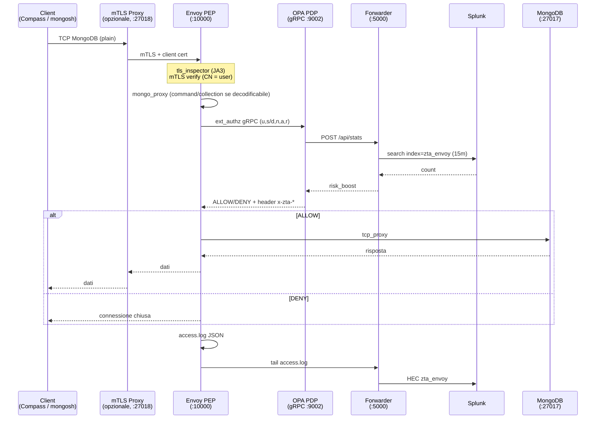
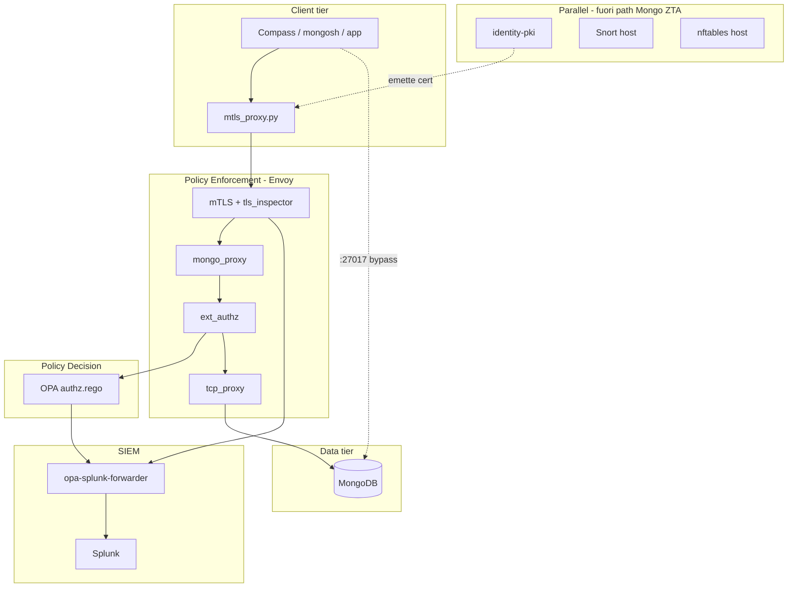

# Zero Trust Architecture — Analisi architettura attuale

Documento di riferimento per il progetto **AdvancedCybersecurity**.  
Confronta l’implementazione attuale con i diagrammi architetturali iniziali (sequence + deployment): Client → Envoy (PEP) → OPA (PDP) + Splunk → MongoDB.

**Data:** maggio 2026  
**Legenda conformità:** ✅ allineato · ⚠️ parziale · ❌ mancante / non allineato

**Documento correlato:** [Piano di chiusura gap](ZTA-gap-closure-plan.md)

---

## 1. Flusso end-to-end (stato attuale)

### Percorsi client

| Percorso | Come funziona |
|----------|----------------|
| **Compass / mongosh “corretto”** | Client → `scripts/mtls_proxy.py` (:27018) → Envoy (:10000 mTLS) → Mongo |
| **Compass senza proxy** | Se punti a `:27017` **salti Envoy** e vai diretto a Mongo (bypass ZTA) |
| **Test mTLS HTTP** | `:10001` solo per verificare certificato, non MongoDB |

Il proxy Python (`scripts/mtls_proxy.py`) non applica policy: aggiunge solo il certificato client verso Envoy.

### Legenda variabili (diagrammi)

| Simbolo | Significato | Dove nel codice |
|---------|-------------|-----------------|
| **u** | User identity (CN certificato) | `input.attributes.source.principal` |
| **s** | Client / OS fingerprint (JA3) | Parzialmente in `device_identity` via JA3 |
| **d** | Device identity (OID / TPM) | Non estratto da cert; fallback `no-tpm` |
| **n** | Network identity (IP) | `source.address` / `network_ip` |
| **a** | Operazione MongoDB | `parsed_body.command` → `action_name` |
| **r** | Risorsa / collection | `parsed_body.collection` → `collection_name` |

---

## 2. Step-by-step vs diagramma sequence

### Step 1 — Handshake mTLS e fingerprinting

| Elemento diagramma | Implementazione | Stato |
|--------------------|-----------------|-------|
| mTLS obbligatorio | `require_client_certificate: true` in `envoy/envoy.yaml` | ✅ |
| User = CN certificato | `authz.rego` → `user_identity` | ✅ |
| Software = JA3 | `tls_inspector` + JA3 in policy | ⚠️ |
| Device = OID attestazione HW | PKI in `identity_pki/`, non letto da Envoy/OPA | ❌ |
| Network = IP | `network_identity` | ✅ |
| Se no HW → solo JA3 | JA3 o `no-tpm` | ⚠️ `s` e `d` non separati |

**Gap:** **s** (fingerprint software) e **d** (device/OID) nel diagramma sono distinti; nel codice convergono in `device_identity` / campo log `device`.

---

### Step 2 — Richiesta MongoDB e metadata (a, r, query)

| Elemento | Implementazione | Stato |
|----------|-----------------|-------|
| `mongo_proxy` estrae command/collection | Filtro in `envoy/envoy.yaml` | ✅ se wire protocol decodificabile |
| Payload query per L7 | `inspection_violation` in **OPA** | ⚠️ layer diverso dal diagramma |
| OP_MSG (Compass / driver moderni) | `action_name == "unknown"` → allow | ❌ bypass RBAC |

**Limiti documentati** (`DOCUMENTATION.md`):

- `ext_authz` è **network-level (TCP)**: decisione spesso **all’apertura connessione**, prima dei comandi Mongo successivi.
- `mongo_proxy` non supporta OP_MSG (opcode 2013) → `parsed_body` vuoto → regola `unknown` permette la connessione.

---

### Step 3 — OPA, Splunk, rischio, soglia

| Elemento diagramma | Implementazione | Stato |
|--------------------|-----------------|-------|
| Envoy → OPA gRPC | `ext_authz` → `opa:9002` | ✅ |
| OPA non logga su Splunk | Nessun `decision_logs` in `docker-compose.yml` | ✅ |
| OPA chiede statistiche Splunk | `http.send` → forwarder `POST /api/stats` → Splunk REST | ⚠️ indiretto |
| Rischio + soglia | `base_risk_score + splunk_risk_boost` vs `threshold` | ✅ |
| Solo rischio decide | Anche RBAC, hard_deny, content inspection | ⚠️ più restrittivo |

**Stats attuali:** conteggio eventi `index=zta_envoy` (15 min) con stesso `(user, network_ip, device, resource, command)` → `risk_boost` 0/5/10/20. Cold start: senza storico, boost = 0.

---

### Step 4 — Dopo ALLOW: L7 e forward

| Elemento diagramma | Implementazione | Stato |
|--------------------|-----------------|-------|
| L7 firewall in Envoy (`http.lua`) | Assente; commento su Lua network non disponibile | ❌ |
| Ispezione contenuto query | In OPA (`inspection_violation`) | ⚠️ |
| `tcp_proxy` → MongoDB | Presente | ✅ |
| Log allow/deny da Envoy | `access.log` + forwarder HEC | ✅ |

---

### Step 5 — Logging Splunk

| Elemento | Implementazione | Stato |
|----------|-----------------|-------|
| Solo Envoy logga | Tail `access.log` → HEC `zta_envoy` | ✅ |
| Campi policy nei log | `%RESP(x-zta-*)%` in `envoy.yaml` | ⚠️ dipende da propagazione header su TCP |
| Dashboard | `splunk/dashboards/zta_overview.xml` (`version="1.1"`) | ✅ |

---

## 3. Mappa componenti

| Componente | Ruolo previsto | Ruolo effettivo | Integrazione |
|------------|----------------|-----------------|--------------|
| **identity-pki** | CA + attestazione device | API PKI/CSR/challenge | ⚠️ non in catena runtime per ogni query |
| **Envoy** | PEP | mTLS, mongo_proxy, ext_authz, log | ✅ core |
| **OPA** | PDP (stats + rischio) | Risk + RBAC + L7 in Rego | ⚠️ più del solo PDP “risk” |
| **opa-splunk-forwarder** | (adapter) | HEC Envoy + API stats per OPA | ⚠️ non nel diagramma originale |
| **Splunk** | Stats + log centrali | Via forwarder | ✅ |
| **MongoDB** | Data tier | DB + porta 27017 esposta in dev | ⚠️ bypass possibile |
| **Snort / nftables** | Difesa rete | Host mode; nftables safe mode default | ❌ fuori flusso Mongo ZTA |

---

## 4. Tabella di conformità

| Requisito architetturale | Stato |
|--------------------------|--------|
| mTLS obbligatorio verso Envoy | ✅ |
| Estrazione u, n | ✅ |
| Estrazione s (JA3) separata da d | ⚠️ |
| Estrazione d (OID / TPM) | ❌ |
| Estrazione a, r da mongo_proxy | ⚠️ spesso `unknown` |
| OPA decide con stats Splunk | ⚠️ stats limitate, via forwarder |
| OPA non scrive log | ✅ |
| Envoy scrive log Splunk | ✅ |
| L7 firewall in Envoy dopo OPA | ❌ |
| Deny/allow per singolo comando su sessione lunga | ❌ |
| Mongo non raggiungibile senza PEP | ❌ in dev |
| Ordine filtri Envoy (deployment diagram) | ✅ |

---

## 5. Sintesi

**Allineato:** separazione PEP / PDP / SIEM; OPA senza logging; Envoy come unico produttore di log verso Splunk; risk score con soglia; catena filtri Envoy documentata.

**Parziale:** identità multi-dimensionale; risk da Splunk semplificato; content inspection in OPA invece che in Envoy.

**Non allineato:** L7 in Envoy; enforcement per comando con OP_MSG/Compass; percorso obbligatorio solo via Envoy; OID/device hardware in runtime; Snort/nftables nel flusso applicativo Mongo.

---

## Riferimenti file progetto

| Area | Path |
|------|------|
| Envoy PEP | `envoy/envoy.yaml` |
| OPA policy | `opa/policies/authz.rego` |
| Forwarder + stats | `scripts/opa_splunk_forwarder/forwarder.py` |
| Orchestrazione | `docker-compose.yml` |
| Client mTLS | `scripts/mtls_proxy.py` |
| PKI | `identity_pki/` |
| Splunk setup | `scripts/splunk_setup.py` |
| Dashboard | `splunk/dashboards/zta_overview.xml` |
| Documentazione operativa | `DOCUMENTATION.md` |
