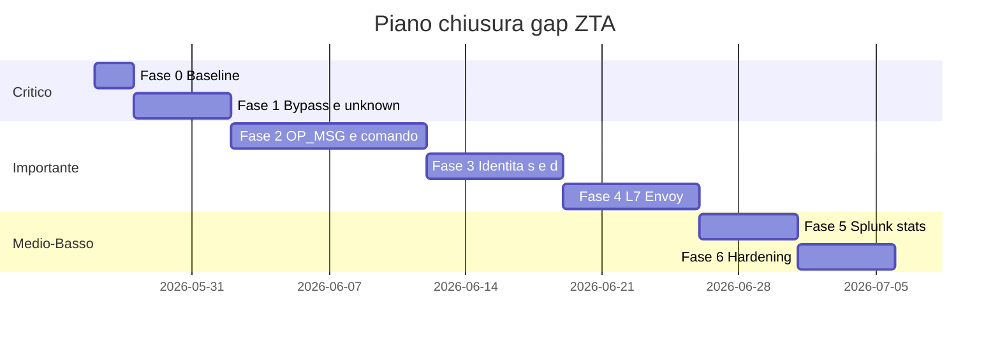

# Zero Trust Architecture — Piano di chiusura gap

Piano operativo per allineare l’implementazione ai diagrammi architetturali ZTA (sequence + deployment).

**Data:** maggio 2026  
**Analisi di partenza:** [ZTA-architecture-analysis.md](ZTA-architecture-analysis.md)

Ogni fase include **deliverable**, **file coinvolti** e **criteri di accettazione**.

---

## Fase 0 — Baseline e misurazione (1–2 giorni)

**Perché:** senza evidenza non si sa se i fix funzionano (soprattutto log Splunk e metadata OPA).

| # | Azione | File / componenti |
|---|--------|-------------------|
| 0.1 | Script o checklist E2E: proxy → Envoy → OPA → Mongo + query Splunk | `scripts/`, Splunk UI |
| 0.2 | Verificare che `access.log` contenga `user`, `decision`, `risk_score` non vuoti dopo una richiesta allow/deny | `envoy/envoy.yaml`, volume `envoy-logs` |
| 0.3 | Documentare in README/docs il **unico** percorso supportato per client (proxy :27018) | `DOCUMENTATION.md` |

**Criteri di accettazione**

- Almeno un evento in `index=zta_envoy` con `decision=ALLOW` o `DENY` e `user` = CN del certificato.
- Diagramma “as-is” aggiornato se emergono differenze rispetto all’analisi.

---

## Fase 1 — Critico: eliminare bypass e buchi immediati (priorità massima)

**Obiettivo:** nessun accesso Mongo “silenzioso” fuori policy.

| # | Gap | Azione proposta | File |
|---|-----|-----------------|------|
| 1.1 | Bypass `:27017` | In produzione/lab stretto: rimuovere `ports: 27017:27017` da `docker-compose.yml` o bind solo su rete interna senza route client; Mongo raggiungibile solo da `envoy` sulla `backend-net` | `docker-compose.yml` |
| 1.2 | Regola `action_name == "unknown"` | **Rimuovere** allow blanket; sostituire con: allow solo per comandi handshake espliciti (`hello`, `isMaster`, `sasl*`, `ping`, …) già in policy; per il resto `unknown` → deny o allow connessione ma deny dati (se tecnicamente possibile) | `opa/policies/authz.rego` |
| 1.3 | Authz solo a connessione | Valutare **Envoy Mongo filter + per-message authz** o **Wasm/Lua** che invoca OPA per ogni messaggio decodificabile; in alternativa documentare come limite noto e ridurre esposizione (1.1) | `envoy/`, ricerca filter OP_MSG |

**Criteri di accettazione**

- Client su rete host **non** può fare `mongosh localhost:27017` con successo (se policy lab = chiusura completa).
- Connessione Compass senza metadata non ottiene accesso dati arbitrario (idealmente deny dopo handshake, o deny totale se non decodificabile).

**Rischio:** rompere Compass finché OP_MSG non è gestito → Fase 2 va pianificata subito dopo o in parallelo.

---

## Fase 2 — Metadata Mongo e enforcement per comando (importante)

**Obiettivo:** allineare **a** (operazione) e **r** (risorsa) al diagramma, anche con driver moderni.

| # | Azione | Dettaglio |
|---|--------|-----------|
| 2.1 | Parser OP_MSG | Filtro **Wasm** (o contrib Envoy) che estrae command, collection, query BSON/JSON e li espone come dynamic metadata per `ext_authz` |
| 2.2 | Ordine filtri | Confermare: metadata disponibile **prima** della chiamata OPA per ogni messaggio (non solo connect) |
| 2.3 | Policy OPA | Input OPA con `parsed_body` popolato; rimuovere dipendenza da `unknown` |
| 2.4 | Test | `scripts/test_mtls_proxy.py` + casi Compass: find/insert su collection sensibile → deny/allow attesi |

**File coinvolti:** `envoy/envoy.yaml`, nuovo `envoy/wasm/` o filter contrib, `opa/policies/authz.rego`, test scripts.

**Criteri di accettazione**

- OPA riceve `command` e `collection` reali su almeno un test Compass/mongosh moderno.
- Regole RBAC e `inspection_violation` si applicano su traffico reale Compass.

---

## Fase 3 — Identità: separare s e d, integrare PKI (importante)

**Obiettivo:** allineamento a Step 1 del sequence diagram (u, s, d, n).

| # | Azione | Dettaglio |
|---|--------|-----------|
| 3.1 | **s** (software) | Campo dedicato `software_identity` = JA3 / JA3 hash; log Envoy + body stats Splunk + header `x-zta-software` |
| 3.2 | **d** (device) | OID o device id da estensione certificato X.509 (emesso da `identity-pki` con attestazione); estrazione in Envoy (Lua/Wasm su cert peer) o pass-through metadata |
| 3.3 | PKI runtime | Flusso documentato: issue cert con device id → client → CN=user, OID=device |
| 3.4 | Policy OPA | `device_risk` usa `d`; `user_risk` usa `u`; opzionale boost se `s` sconosciuto |

**File coinvolti:** `identity_pki/`, `envoy/envoy.yaml`, `opa/policies/authz.rego`, `forwarder.py` (stats query con `software` + `device`).

**Criteri di accettazione**

- Log Splunk distinguono `software` e `device`.
- Certificato hardware-bound → `device_risk = 0`; solo JA3 → rischio software più alto.

---

## Fase 4 — L7 firewall in Envoy (dopo OPA allow)

**Obiettivo:** replicare il ramo diagramma “Content Allowed / Content Denied” in **Envoy**, non solo in OPA.

| # | Azione | Dettaglio |
|---|--------|-----------|
| 4.1 | Filtro L7 post-authz | Wasm/Lua network filter: se OPA ha allow, ispeziona payload query (regex/JSON) per regole L7 (es. `$where` su billing, `patient_id` su clinical_records) |
| 4.2 | Deny locale | Match negativo → chiusura connessione / errore Mongo senza forward |
| 4.3 | Duplicazione policy | Mantenere OPA come PDP principale; L7 Envoy come **seconda linea** (defense in depth) oppure spostare inspection solo in Envoy e semplificare Rego |

**Nota:** il deployment diagram mostra `http.lua` su path HTTP; per Mongo serve **network Wasm/Lua**, non `http_connection_manager`.

**Criteri di accettazione**

- Query con `$where` su `billing` bloccata anche se OPA allow (test esplicito).
- Log Envoy/Splunk registrano deny L7 distinto da deny OPA (campo `deny_reason`).

---

## Fase 5 — Splunk e OPA: stats e osservabilità (medio)

**Obiettivo:** stats più fedeli al diagramma “OPA chiede statistiche a Splunk”.

| # | Azione | Dettaglio |
|---|--------|-----------|
| 5.1 | Arricchire `/api/stats` | Oltre a `event_count_15m`: deny_rate, distinct devices, ultimo deny timestamp |
| 5.2 | Modello rischio | Documentare formula in `authz.rego`; parametrizzare soglie via `data.json` OPA |
| 5.3 | OPA → Splunk diretto (opzionale) | Sostituire forwarder con `http.send` a Splunk REST da OPA, o mantenere forwarder come unico punto credenziali |
| 5.4 | Dashboard | Pannelli per `software`, `device`, deny L7 vs OPA |

**Criteri di accettazione**

- Burst di richieste identiche aumenta `splunk_risk_boost` e può portare a deny.
- Dashboard riflette solo `zta_envoy` con campi popolati.

---

## Fase 6 — Difesa in profondità e produzione (basso / hardening)

| # | Azione |
|---|--------|
| 6.1 | Snort/nftables: regole che coprono traffico verso :10000 / segmentazione `frontend-net` / `backend-net` |
| 6.2 | `APPLY_NFT_RULES=1` documentato; log nftables verso Splunk (opzionale) |
| 6.3 | mTLS proxy: rimuovere `--insecure` default in lab documentato; PKI con AKI/SAN corretti |
| 6.4 | SDS per certificati Envoy |
| 6.5 | Rate limiting / circuit breaker su cluster `opa_cluster` |

---

## Roadmap riassuntiva

| Fase | Priorità | Impatto sicurezza | Dipendenze |
|------|----------|-------------------|------------|
| 0 | Alta | Basso (misura) | — |
| 1 | **Critica** | **Altissimo** | 0 |
| 2 | Alta | Alto | 1 (può rompere client finché non pronta) |
| 3 | Media-alta | Medio-alto | 1 |
| 4 | Media | Medio | 2 (serve payload query) |
| 5 | Media | Medio | log affidabili (0) |
| 6 | Bassa | Medio (perimetro) | — |

---

## Riferimenti file progetto

| Area | Path |
|------|------|
| Envoy PEP | `envoy/envoy.yaml` |
| OPA policy | `opa/policies/authz.rego` |
| Forwarder + stats | `scripts/opa_splunk_forwarder/forwarder.py` |
| Orchestrazione | `docker-compose.yml` |
| Client mTLS | `scripts/mtls_proxy.py` |
| PKI | `identity_pki/` |
| Splunk setup | `scripts/splunk_setup.py` |
| Dashboard | `splunk/dashboards/zta_overview.xml` |
| Documentazione operativa | `DOCUMENTATION.md` |

---

## Prossimo passo consigliato

Iniziare da **Fase 0 + Fase 1.1–1.2** (chiudere bypass Mongo e regola `unknown`), poi avviare **Fase 2** in parallelo se Compass deve continuare a funzionare con enforcement reale.

Per implementazione nel repo, usare modalità **Agent** e indicare la fase (es. “implementa Fase 1”).
