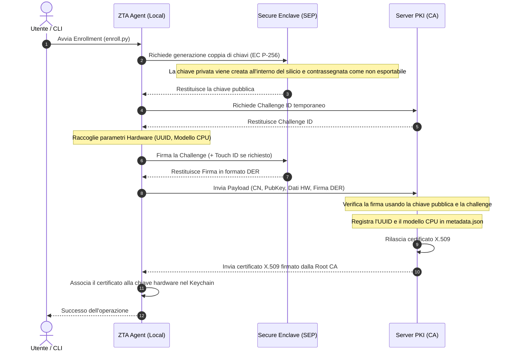

# Flusso di Enrollment Hardware-Bound

L'enrollment è il processo mediante il quale un dispositivo client ottiene un'identità crittografica (certificato X.509) legata in modo indissolubile al suo hardware fisico (Secure Enclave su macOS o TPM su Windows).

---

## Fasi del Processo di Enrollment

---

## Dettagli Tecnici dell'Implementazione

### 1. Generazione Chiave Locale (Client)
*   **macOS**: La chiave privata Elliptic Curve P-256 viene creata impostando `kSecAttrTokenID` su `kSecAttrTokenIDSecureEnclave`. Questo assicura che le chiavi non possano mai essere estratte dalla memoria dell'applicazione.
*   **Windows**: La chiave viene generata sfruttando il provider **Microsoft Platform Crypto Provider** per l'interazione diretta con il chip TPM 2.0 fisico della macchina.

### 2. Proof of Possession (PoP)
Per prevenire attacchi di tipo *man-in-the-middle* o l'utilizzo di chiavi pubbliche non appartenenti al client richiedente, il client deve firmare crittograficamente la stringa di sfida (*challenge*):
$$\text{Firma} = \text{Sign}_{\text{SEP}}(\text{Challenge ID} \parallel \text{CN} \parallel \text{Time})$$
Questa firma viene validata dal server PKI prima di emettere qualsiasi certificato.

### 3. Registrazione dei Metadati Hardware
Durante l'enrollment, i dati hardware inviati dall'agente nativo (rilevati direttamente dal sistema operativo via `IOKit` e `sysctl`) vengono estratti dal server PKI e scritti nel file `/volumes/certs/ca/issued/<CN>/metadata.json`:
*   `mac`: L'UUID hardware del computer (che funge da identificativo unico di macchina stabile).
*   `cpu`: Il brand string della CPU (es. *Apple M4* o *Intel Core i7*).

Questi metadati consentono controlli incrociati costanti per garantire che lo stesso certificato non venga clonato o trasferito su un'altra macchina con caratteristiche diverse.

---
*Ultimo Aggiornamento: Maggio 2026*
