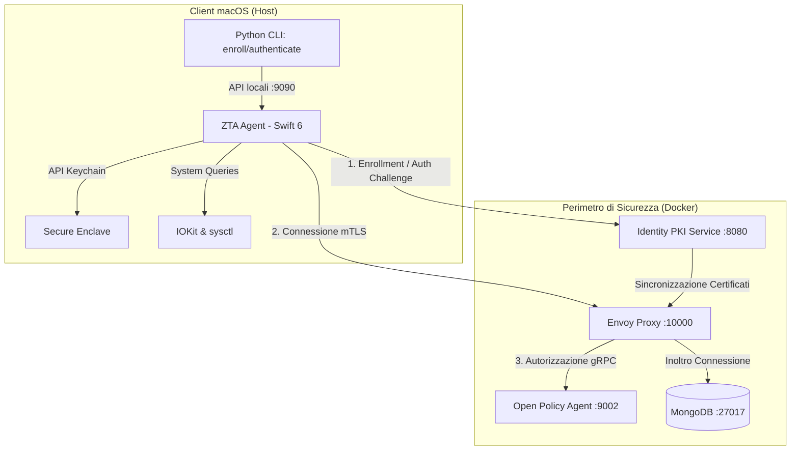

# Panoramica del Sistema Zero Trust (ZTA)

Questo documento fornisce una descrizione dettagliata dell'architettura **Zero Trust** aggiornata, basata sull'integrazione profonda con il sistema operativo macOS tramite un **Agente Nativo in Swift 6** e l'uso del **Secure Enclave (SEP)**.

---

## 1. Architettura dei Componenti

Il sistema si divide in due macro-aree: lo **Spazio Client (macOS)** e il **Perimetro di Fiducia (Container Docker)**.



---

## 2. L'Agente Nativo macOS (`ZTAAgent`)

L'agente nativo è un'applicazione macOS scritta in **Swift 6** conforme ai più moderni standard di concorrenza asincrona (`async/await`). Svolge il ruolo di intermediario crittografico e custode delle chiavi hardware.

### A. Local API Server (`LocalAPIServer.swift`)
Ascolta sulla porta locale `localhost:9090` e funge da ponte tra gli script CLI e le funzionalità del sistema operativo. Espone i seguenti endpoint:
*   `POST /enroll`: Avvia la generazione della chiave nel Secure Enclave, raccoglie i dati hardware ed effettua la registrazione presso il PKI.
*   `POST /sign`: Riceve una challenge in formato stringa e restituisce una firma crittografica firmata con la chiave privata protetta nel SEP. La firma viene esportata nel formato standard **ASN.1/DER** richiesto dal server crittografico.
*   `GET /status`: Restituisce lo stato di salute dell'agente e le chiavi registrate.

### B. Hardware Manager (`HardwareManager.swift`)
Raccoglie in modo sicuro e resistente alle manomissioni gli identificativi hardware della macchina:
1.  **UUID di Sistema**: Estratto interrogando la scheda madre tramite le API di basso livello di `IOKit` (`IOPlatformExpertDevice`).
2.  **Modello CPU**: Ottenuto leggendo le variabili di sistema tramite chiamata `sysctlbyname` con la chiave `machdep.cpu.brand_string` (es. *Apple M4*).

### C. Gestione delle Chiavi nel Secure Enclave
Le chiavi asimmetriche (Elliptic Curve P-256) vengono generate impostando i seguenti attributi di sicurezza:
*   `kSecAttrTokenID`: Valorizzato a `kSecAttrTokenIDSecureEnclave`. Questo vincola fisicamente la chiave privata all'interno del chip coprocessore di sicurezza Apple (Secure Enclave).
*   `kSecAttrAccessControl`: Configurato per richiedere l'autorizzazione dell'utente (Touch ID o Password di sistema) per l'uso della chiave privata.
*   **Impossibilità di Esportazione**: La chiave privata non può mai lasciare il silicio del Secure Enclave; ogni operazione di firma avviene internamente al chip.

---

## 3. Servizi nel Perimetro di Rete

### A. Identity PKI Service (`identity_pki`)
Gestisce l'autorità di certificazione (CA) dinamica in esecuzione in un container Flask:
*   **Generazione della CA**: All'avvio, se non presenti, inizializza le chiavi e il certificato della Root CA.
*   **Generazione Certificati Envoy**: Genera autonomamente chiavi e certificati server per Envoy (aggiornando i volumi mappati) per eliminare passaggi manuali.
*   **Emissione di Identità Hardware**: Riceve il payload di enrollment, verifica la Proof of Possession del client, mappa e associa i dettagli hardware (`mac_address` e `cpu_id`) all'identità nel file persistente `metadata.json`.

### B. Envoy Proxy (PEP — Policy Enforcement Point)
È il guardiano di rete per MongoDB:
*   **mTLS Obbligatorio**: Richiede un certificato client firmato dalla Root CA del PKI. Rifiuta la connessione a livello TCP se il certificato non è valido o assente.
*   **Ispezione L7**: Utilizza il filtro `envoy.filters.network.mongo_proxy` per decodificare il protocollo binario BSON di MongoDB, catturando l'operazione esatta (es. `find`, `insert`, `drop`) e la collezione target.
*   **Filtro Lua**: Estrae il Common Name (CN) del certificato e lo invia come identità utente al PDP.

### C. Open Policy Agent (OPA — PDP)
Valuta le richieste autorizzative calcolando in tempo reale un punteggio di rischio dinamico:
*   **User Risk**: Utente noto (0) o sconosciuto (30).
*   **Device Risk**: Chiave validata nel Secure Enclave (0) o fingerprint generico (20).
*   **Network Risk**: Rete interna fidata (0) o provenienza esterna (15).
*   **Soglie di Azione**: Ogni comando ha una tolleranza al rischio (es. `find` = 60, `insert` = 40, `drop` = DENY assoluto).

---

## 4. Flusso Operativo End-to-End

### Fase 1: Enrollment
```
[Utente] ──> [enroll.py] ──> [ZTA Agent (:9090)] ──> [Secure Enclave] (Genera Chiave)
                                    │
                                    ├──> [Richiede Challenge] ──> [PKI (:8080)]
                                    ├──> [Firma Challenge con SEP]
                                    └──> [Invia CSR + Dati HW + Firma] ──> [PKI]
                                                                            │
                                                                    (Salva metadata.json)
```

### Fase 2: Autenticazione & Accesso
1.  **Layer 1 (Verifica Identità)**:
    *   `authenticate.py` richiede una challenge al PKI.
    *   Invia la challenge a `ZTA Agent` che richiede l'autorizzazione biometrica (Touch ID) per firmarla tramite il Secure Enclave.
    *   La firma DER viene verificata dal PKI server, confermando che l'utente possiede fisicamente il dispositivo registrato.
2.  **Layer 2 (Perimetro mTLS)**:
    *   Il client effettua la chiamata mTLS verso Envoy.
    *   Il backend di rete del sistema operativo macOS delega l'handshake TLS al `ZTA Agent` che associa dinamicamente la chiave privata del Secure Enclave e il certificato registrato.
3.  **Layer 3 (Policy OPA)**:
    *   Envoy decodifica la richiesta MongoDB, recupera il CN e invia il contesto a OPA.
    *   OPA autorizza l'accesso se il rischio calcolato è inferiore alla soglia impostata per l'operazione.

---
*Ultimo Aggiornamento: Maggio 2026*
